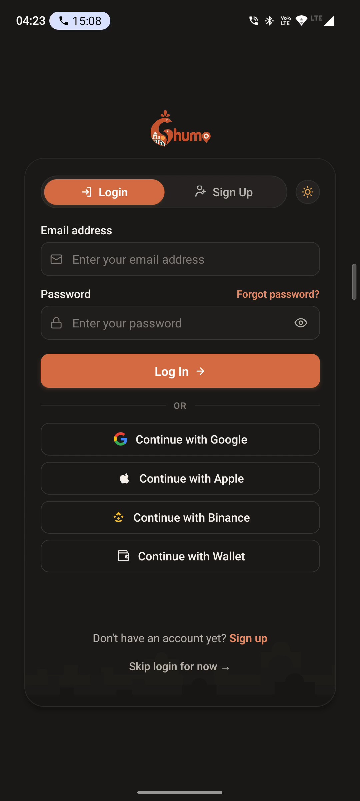
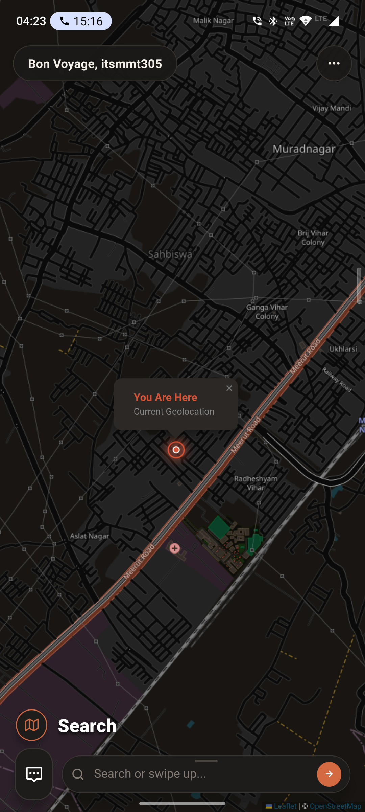
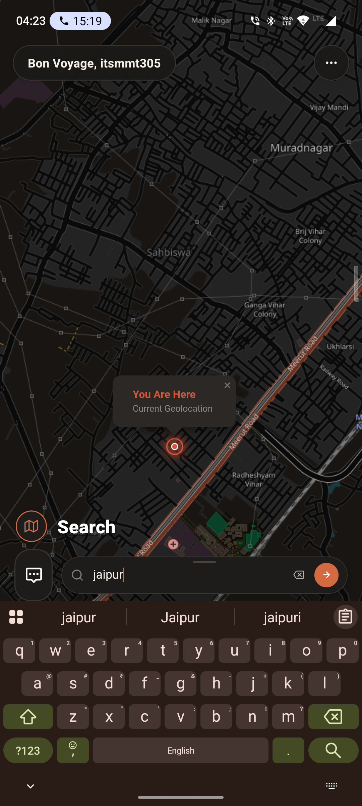
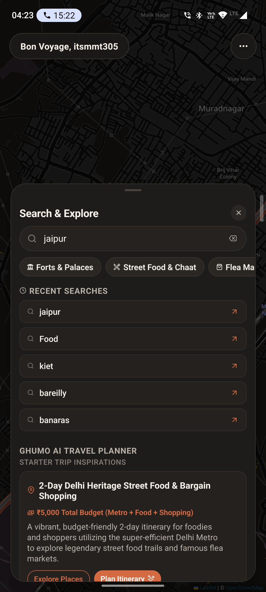
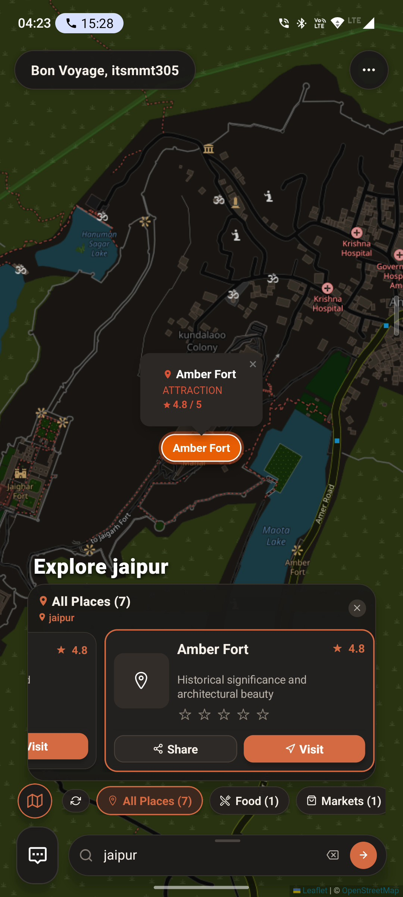
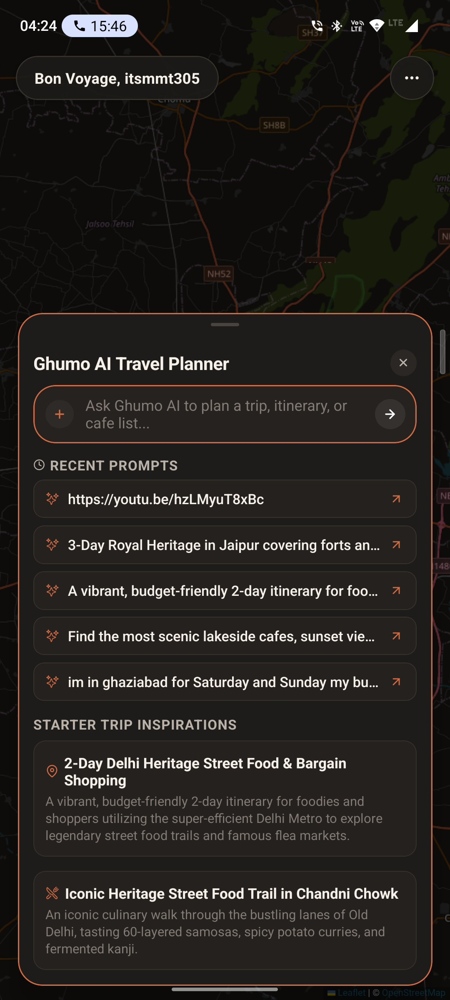
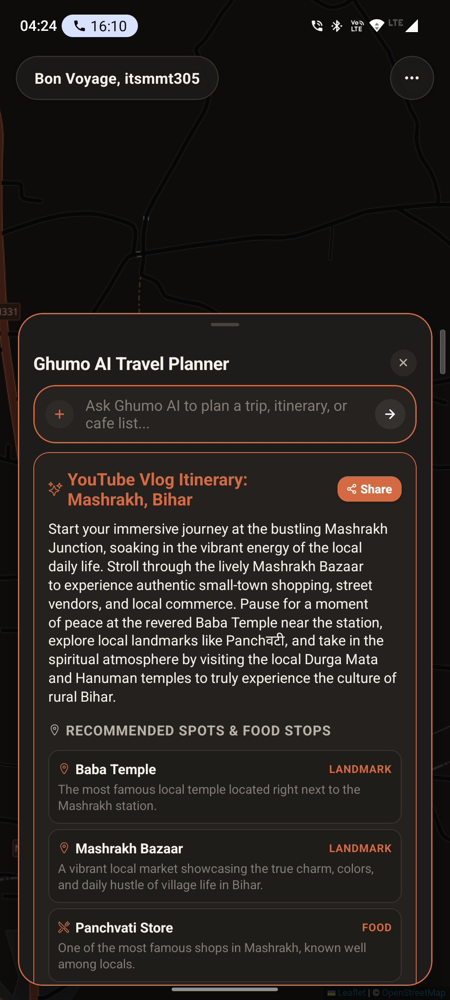
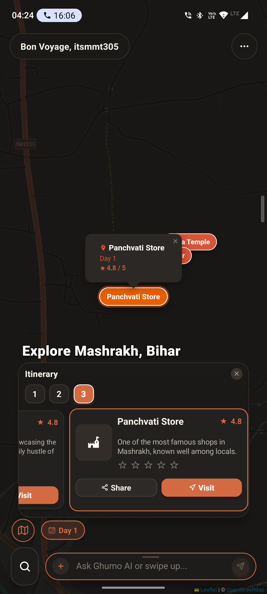
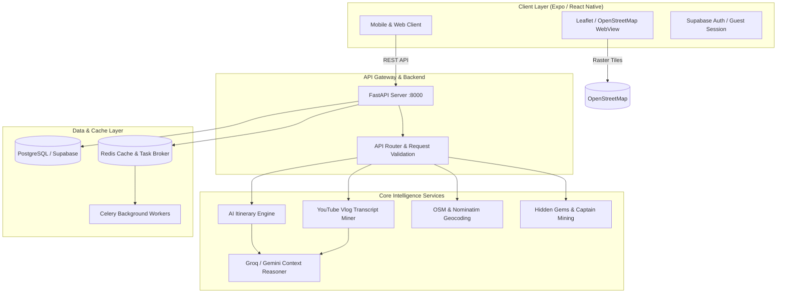

# Ghumo (घूमो) — AI Hyper-Local Travel Companion & Multi-Modal Discovery Platform

[](https://fastapi.tiangolo.com/)
[](https://expo.dev/)
[](https://www.typescriptlang.org/)
[](https://python.org/)
[](https://supabase.com/)
[](https://www.openstreetmap.org/)
[](https://aavvvacado.github.io/ghumo/)
[](https://github.com/aavvvacado/ghumo)

> **Ghumo** (घूमो • *to wander / explore*) is a next-generation, AI-driven travel discovery engine and day-wise itinerary planner. It bridges hyper-local geographic exploration with multi-modal intelligence: travelers can discover hidden gems, explore dark-mode interactive maps, and convert any natural language request or **YouTube travel vlog link** into a rich, sequential day-by-day itinerary with exact POI coordinates.

---

## Production Engineering Documentation Suite

The complete, deeply technical engineering documentation suite is published and deployed via GitHub Pages:
 **[Access the Ghumo Engineering Documentation Portal](https://aavvvacado.github.io/ghumo/)**

| Document | Topic & Focus Area |
| :--- | :--- |
| [**01. Executive Summary & Architecture**](https://aavvvacado.github.io/ghumo/01-Executive-Summary) | Project mission, technical deliverables, monorepo anatomy, and end-to-end data flow |
| [**02. Decoupled Search & Caching Tiers**](https://aavvvacado.github.io/ghumo/02-Decoupled-Search-and-Caching-Tiers) | 4-tier resolution engine (<50ms Valkey cache, AIContext, Anchor Landmark collision elevation) |
| [**03. AI Reasoning & Itinerary Synthesis**](https://aavvvacado.github.io/ghumo/03-AI-Reasoning-and-Itinerary-Synthesis) | Google Gemini 2.5 Flash, Groq Llama-3 fallback, strict JSON schemas, and geo-temporal pacing |
| [**04. YouTube Vlog & Social Media Mining**](https://aavvvacado.github.io/ghumo/04-YouTube-Vlog-and-Social-Media-Mining) | Transcript mining, timestamp landmark alignment, Instagram/TikTok reels, and Reddit sentiment |
| [**05. Geospatial Pipeline & Knowledge Graph**](https://aavvvacado.github.io/ghumo/05-Geospatial-Pipeline-and-Knowledge-Graph) | Nominatim geocoding, 8km Overpass QL radial scans, Haversine spatial matrix, and graph edges |
| [**06. Place Quality & Image Pipeline**](https://aavvvacado.github.io/ghumo/06-Place-Quality-and-Image-Resolution) | Zero AI hallucination guarantee, blacklist filtering, Wikimedia Commons SPARQL, and Unsplash API |
| [**07. Local Captains & Bayesian Confidence**](https://aavvvacado.github.io/ghumo/07-Crowdsourcing-and-Bayesian-Confidence) | Guide submissions, multi-signal confidence math, Bayesian rating smoothing, and smart DB merge |
| [**08. Frontend Architecture & Expo SDK 57**](https://aavvvacado.github.io/ghumo/08-Frontend-Architecture-and-State-Management) | React Native 0.76+, Expo SDK 57, TypeScript domain contracts, and layered screen composition |
| [**09. Zero-Watermark Dark Map Pipeline**](https://aavvvacado.github.io/ghumo/09-Custom-Dark-Map-and-WebView-Pipeline) | Leaflet WebView, zero API keys, custom CSS dark-charcoal shaders, glowing radar beacons, and JS bridge |
| [**10. Dynamic Morphing UI & Interaction**](https://aavvvacado.github.io/ghumo/10-Dynamic-UI-and-Interaction-Engine) | DynamicBottomBar state machine, downward gravity MapPlaceCarousel, PromptView, and warm ivory styling |
| [**11. Real-Time SSE Streaming & Tasks**](https://aavvvacado.github.io/ghumo/11-Real-Time-Streaming-SSE-and-Background-Tasks) | Server-Sent Events protocols, in-process asyncio tasks, Celery workers, and anti-ban jitter crawlers |
| [**12. Local Setup & Engineering Guide**](https://aavvvacado.github.io/ghumo/12-Local-Setup-and-Engineering-Guide) | Complete environment setup, Supabase migration, LAN mobile configuration, Pytest, and TypeScript checks |
| [**13. What Went Wrong: Post-Mortems**](https://aavvvacado.github.io/ghumo/13-What-Went-Wrong-Engineering-Postmortems) | 8 real post-mortems: Expo Go map key blockages, Overpass rate limits, collision bugs, and crawler freezing |
| [**14. Scaling & Future Engineering Roadmap**](https://aavvvacado.github.io/ghumo/14-Scaling-and-Future-Roadmap) | PostGIS geometry migration, pgvector RAG, Whisper AI audio transcription, and offline MapLibre tiles |

---

## Submission Overview (Production Architecture )

This repository is unified as a **single public monorepo** housing both the production-ready **Frontend** application and the scalable **Backend** API services, adhering strictly to the recruitment drive guidelines.

- **Candidate**: Vishal ([@aavvvacado](https://github.com/aavvvacado))
- **Institution**: KIET Group of Institutions
- **Platform**: Production Monorepo
- **Repository Structure**:
 - [`frontend/`](./frontend) — Mobile/Web app built with Expo SDK 57, React Native, TypeScript, Leaflet.js, and Supabase client.
 - [`backend/`](./backend) — Scalable microservice built with FastAPI, PostgreSQL/Supabase, Redis, Celery workers, and LLM reasoning.
 - [`demos/`](./demos) — High-resolution UI showcase samples and full walkthrough video.

---

## Visual Showcase & App Gallery

<div align="center">
 <table>
 <tr>
 <td align="center" width="25%">
 
 <br />
 <sub><b> Smart Auth & Guest Mode</b></sub>
 </td>
 <td align="center" width="25%">
 
 <br />
 <sub><b> Live Map & Geolocation</b></sub>
 </td>
 <td align="center" width="25%">
 
 <br />
 <sub><b> Instant Search Flow</b></sub>
 </td>
 <td align="center" width="25%">
 
 <br />
 <sub><b> Explore & Inspirations</b></sub>
 </td>
 </tr>
 <tr>
 <td align="center" width="25%">
 
 <br />
 <sub><b> Interactive Map POIs</b></sub>
 </td>
 <td align="center" width="25%">
 
 <br />
 <sub><b> AI Planner Hub</b></sub>
 </td>
 <td align="center" width="25%">
 
 <br />
 <sub><b> YouTube Video AI Itinerary</b></sub>
 </td>
 <td align="center" width="25%">
 
 <br />
 <sub><b> Day-wise Map Waypoints</b></sub>
 </td>
 </tr>
 </table>
</div>

### Walkthrough Video
A full end-to-end screen recording demonstrating the onboarding flow, interactive dark map, live search, POI cards, and AI trip planning is stored locally in the repo:
- **Local Video**: [`demos/samples/screen-20260912-042441.mp4`](./demos/samples/screen-20260912-042441.mp4)
- **Direct Drive Mirror**: [Google Drive Demo Link](https://drive.google.com/file/d/1fdwcIu-PEz1ir1Ty-1IAjUNW75siFkqM/view?usp=drive_link)

---

## System Architecture



---

## Key Features

### 1. YouTube Travel Vlog to Structured Itinerary
Paste any YouTube travel vlog link (e.g. *"48 Hours in Jaipur"* or *"Varanasi Hidden Street Food Walk"*). Ghumo extracts the transcript, parses timestamps and spoken landmarks through our LLM extraction pipeline, coordinates matching POIs via OpenStreetMap, and generates a structured, day-wise schedule complete with budget estimates, transport suggestions, and historical lore.

### 2. Zero-Watermark Custom Dark Map
Powered by Leaflet.js and OpenStreetMap raster tiles rendered within a native WebView wrapper. Ghumo requires no expensive third-party map keys and renders with a custom high-contrast dark charcoal filter (`#1B1918`), fluid pinch-to-zoom gestures, custom glowing user location beacons, and animated POI markers.

### 3. Hyper-Local Discovery & Hidden Gems
Surfaces lesser-known local attractions (*"baoris"*, hidden bakeries, heritage ghats, and artisan markets) mined through community contributions and social crawler services, avoiding tourist traps.

### 4. Context Reasoning Engine (Groq / Gemini)
Every destination card provides deep contextual insights:
- **Best time of day to visit** (e.g., golden hour, early morning Aarti)
- **Local etiquette & dress codes**
- **Must-try culinary pairings**
- **Safety notes & estimated stay duration**

---

## Monorepo Organization

```
ghumo/
├── frontend/                     # Expo SDK 57 React Native App
│   ├── assets/                   # Fonts, icons, branding
│   ├── src/
│   │   ├── components/           # Glassmorphic UI components, MapView, Sheets
│   │   ├── data/                 # API client, services, repositories
│   │   ├── domain/               # TypeScript interfaces & domain models
│   │   ├── hooks/                # Color scheme, theme, and location hooks
│   │   └── utils/                # Geo-calculation helpers and loggers
│   ├── app.json                  # Expo project manifest
│   ├── package.json              # NPM dependencies
│   └── .env.example              # Frontend environment template
│
├── backend/                      # FastAPI Python Application
│   ├── app/
│   │   ├── api/                  # FastAPI routers, schemas, validation
│   │   ├── crawlers/             # Social mining & web scrapers
│   │   ├── database/             # SQLAlchemy ORM models & session manager
│   │   ├── services/             # AI planner, YouTube parser, Geocoding, OSM
│   │   ├── tasks/                # Celery async worker tasks
│   │   └── utils/                # Config, HTTP clients, and error handlers
│   ├── tests/                    # Pytest integration & unit test suite
│   ├── requirements.txt          # Production Python dependencies
│   ├── pyproject.toml            # Project packaging metadata
│   └── .env.example              # Backend environment template
│
├── demos/                        # Visual assets & screen recordings
│   └── samples/                  # Screenshots and walkthrough MP4
│
├── .gitignore                    # Unified multi-language exclusion rules
└── README.md                     # Monorepo documentation
```

---

## Quickstart & Local Setup

### 1. Prerequisites
- **Node.js**: v18+ and `npm`
- **Python**: v3.10+
- **Redis** *(Optional for local background tasks)*: Docker or local service

---

### 2. Backend Setup

```bash
# Navigate to the backend directory
cd backend

# Create and activate virtual environment
python -m venv venv

# On Windows:
.\venv\Scripts\activate
# On Linux/macOS:
source venv/bin/activate

# Install dependencies
pip install -r requirements.txt

# Configure environment variables
copy .env.example .env # (Windows) or cp .env.example .env (Linux/macOS)

# Start the FastAPI server
uvicorn app.main:app --reload --host 0.0.0.0 --port 8000
```

The backend API will be live at:
- **API Base**: `http://localhost:8000`
- **Interactive Swagger Docs**: `http://localhost:8000/docs`
- **Health Check**: `http://localhost:8000/health`

---

### 3. Frontend Setup

```bash
# In a new terminal, navigate to the frontend directory
cd frontend

# Install dependencies
npm install

# Configure environment variables
copy .env.example .env # (Windows) or cp .env.example .env (Linux/macOS)

# Start Expo development server
npx expo start
```

Press:
- `w` to open in your web browser.
- `a` to run on an attached Android emulator/device.
- Scan the QR code using the **Expo Go** app on your physical mobile phone.

---

## API Endpoints Summary

| Method | Endpoint | Description |
| :--- | :--- | :--- |
| `GET` | `/health` | Service health status check |
| `GET` | `/search?q={query}&lat={lat}&lon={lon}` | Multi-source POI and landmark search |
| `POST` | `/itinerary/plan` | Generates multi-day itinerary from natural language prompt |
| `POST` | `/itinerary/from-youtube` | Parses travel vlog URL and constructs day-by-day travel plan |
| `GET` | `/hidden-gems` | Fetches community-vetted hidden gems by city or coordinates |
| `GET` | `/places/{id}/context` | Fetches AI-reasoned cultural tips, food suggestions, and best hours |
| `POST` | `/contributions` | Submits traveler feedback, ratings, and gem recommendations |

---

## License & Contact

- **Author**: Vishal ([@aavvvacado](https://github.com/aavvvacado))
- **Email**: vpratapsingh099@gmail.com (ghub: ashking.vp123@gmail.com)
- **License**: MIT License
