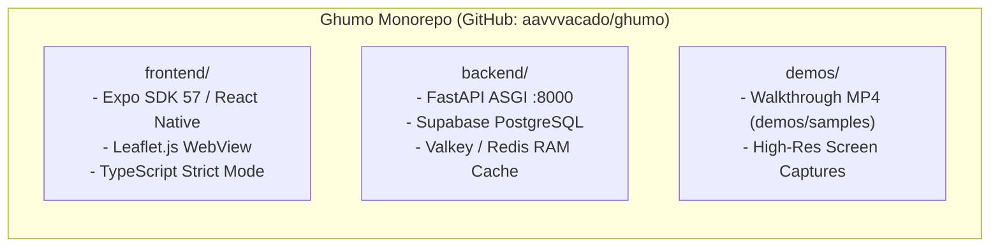
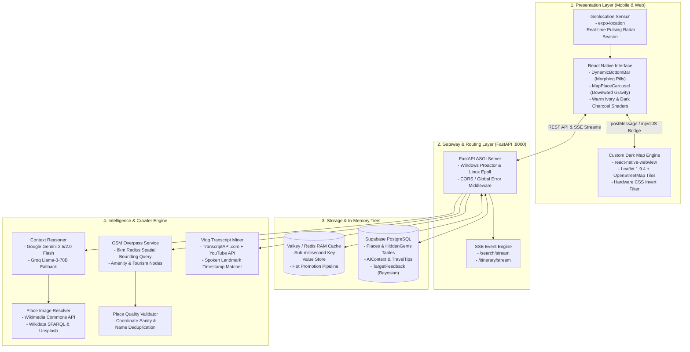

# Executive Summary & System Architecture

This document presents the overarching architectural blueprint of **Ghumo (घूमो)**, outlining its technical motivation, problem space, subsystem topology, evaluation deliverables, and complete monorepo anatomy.

---

## 1. Motivation & Problem Space

Traditional consumer travel platforms (Google Maps, TripAdvisor, MakeMyTrip) exhibit three fundamental architectural limitations:

1. **Commercial Tourist Bias**: Algorithms heavily favor sponsored commercial establishments and tourist traps, obscuring genuine hyper-local heritage, student hangouts, and authentic street food.
2. **Fragmented Travel Research**: Travelers spend hours watching YouTube vlogs, Instagram reels, and reading Reddit threads, manually jotting down POI names, opening navigation apps to verify coordinates, and piecing together day-wise travel plans.
3. **Expensive, Walled-Garden APIs**: Mainstream mapping SDKs (Google Maps JavaScript API, Places API, Directions API) impose steep per-query billing, strict watermarks, and credit-card enforcement, creating severe barriers for cost-effective deployment and open ecosystem extensibility.

### The Ghumo Solution
Ghumo solves this through a **Decoupled Local Intelligence Architecture**:
- **Multi-Modal Video Mining**: Extracts timecoded transcripts from YouTube vlogs and social videos, isolates spoken landmarks via LLMs, and maps them to physical OpenStreetMap coordinates.
- **Zero-Key Dark Map**: Employs Leaflet.js inside a native WebView wrapper with custom CSS charcoal shaders, achieving a high-contrast dark aesthetic with zero external API key requirements.
- **4-Tier Fast Cache & Live Synthesis**: Responds in `< 50ms` for cached destinations while executing non-blocking multi-source research (OSM Overpass, Reddit sentiment, web crawlers, and Google Gemini AI) for new locations.
- **Local Captain Crowdsourcing**: Incorporates authentic, community-vetted recommendations with Bayesian rating confidence.

---

## 2. Submission Deliverables & Rubric Mapping

This repository is unified as a **single public monorepo** housing both the production-ready **Frontend** application and the scalable **Backend** API services, adhering strictly to the recruitment drive guidelines.



| Evaluation Rubric | Implementation Highlight | Verification Evidence |
| :--- | :--- | :--- |
| **System Architecture** | Decoupled 4-tier fast-cache & asynchronous live discovery engine. | Clean separation in `enrichment_service.py` and `search_service.py` |
| **Multi-Modal AI Integration** | YouTube vlog & social video transcript parsing with Google Gemini 2.5 Flash. | Tested across travel vlogs; day-wise itinerary generation |
| **Mobile & Web Client** | Fluid React Native client on Expo SDK 57 with dynamic morphing UI and custom dark map. | Runs on Web, Android Emulator, and physical phones via Expo Go |
| **Data Quality & Reliability** | Zero AI-hallucinated images; strict place quality validator; Anchor Landmark collision protection. | Real Creative Commons photos via Wikimedia Commons & Unsplash API |
| **Code Cleanliness & Types** | Strict TypeScript domain models and Pydantic v2 schemas; modular service layers. | Zero TypeScript errors (`npx tsc --noEmit`); passing Pytest suite |

---

## 3. High-Level Subsystem Topology



---

## 4. Monorepo Anatomy & Codebase Layout

The monorepo enforces clean domain boundaries across mobile, backend, and documentation assets:

```
ghumo/
├── frontend/ # Expo SDK 57 React Native Application
│ ├── assets/ # Custom brand iconography, fonts, and assets
│ ├── src/
│ │ ├── app/ # Expo Router application entry
│ │ │ ├── _layout.tsx # App-wide context providers & layout hierarchy
│ │ │ └── index.tsx # Root home screen coordinating layers 1 through 6
│ │ ├── components/ # Clean reusable UI components
│ │ │ ├── auth/ # BrandHeader, AuthCard, AuthLoadingOverlay
│ │ │ ├── common/ # ExitConfirmationModal, GlassCard, StatusPill
│ │ │ ├── home/ # DynamicBottomBar, MapBackground, MapPlaceCarousel,
│ │ │ │ # PromptView, SearchView, HomeTopBar
│ │ │ └── ui/ # Button, TextInput, Icon components
│ │ ├── constants/ # Palette definitions (Warm Ivory, Dark Charcoal)
│ │ ├── context/ # State management providers
│ │ │ ├── authContext.tsx # Supabase Auth session & guest state
│ │ │ ├── themeContext.tsx # Dark / light theme & opacity animation state
│ │ │ └── homeContext.tsx # Search query, map visibility, and bottom sheet state
│ │ ├── domain/ # TypeScript interfaces & domain contracts
│ │ ├── hooks/ # Custom React hooks (location, debouncing, animations)
│ │ └── utils/ # Logger, math utilities, and coordinate helpers
│ ├── app.json # Expo application manifest
│ ├── package.json # NPM dependencies and build scripts
│ └── tsconfig.json # TypeScript strict configuration
│
├── backend/ # FastAPI Python Application
│ ├── app/
│ │ ├── api/ # Routing & request schemas
│ │ │ ├── router.py # Route declarations (/search, /itinerary, /recommendations)
│ │ │ └── schemas.py # Pydantic v2 validation contracts
│ │ ├── crawlers/ # Multi-source web scraping engine
│ │ │ ├── cloudflare_crawler.py # Headless scraping with anti-bot bypass
│ │ │ └── blog_crawler.py # Indian travel blog text extractor
│ │ ├── database/ # Persistence layer
│ │ │ ├── models.py # SQLAlchemy ORM models (Place, HiddenGem, AIContext)
│ │ │ └── session.py # Database engine and sequence synchronizer
│ │ ├── services/ # Business logic & microservices
│ │ │ ├── enrichment_service.py # 4-tier resolution & anchor landmark collision handler
│ │ │ ├── search_service.py # Aggregated search coordinator
│ │ │ ├── itinerary_service.py # Day-wise itinerary planner & chunked scheduler
│ │ │ ├── youtube_service.py # Vlog transcript miner & timestamp parser
│ │ │ ├── social_mining.py # Instagram Reels, TikTok, and video URL processor
│ │ │ ├── osm_service.py # Nominatim geocoding & Overpass 8km scan
│ │ │ ├── knowledge_graph_service.py # Spatial Haversine relational graph
│ │ │ ├── place_image_resolver.py # Multi-source Creative Commons image pipeline
│ │ │ ├── place_quality_validator.py # Anti-hallucination name & coordinate validator
│ │ │ ├── feedback_service.py # Bayesian weighted scoring engine
│ │ │ ├── cache_service.py # Valkey / Redis async connection manager
│ │ │ └── discovery_agent.py # Autonomous background city registry scanner
│ │ ├── tasks/ # Celery asynchronous task definitions
│ │ │ └── miner_tasks.py # Long-running background crawl workers
│ │ ├── utils/ # Global error handlers, configuration, and helpers
│ │ ├── celery_app.py # Celery worker initialization
│ │ └── main.py # FastAPI lifespan application entry point
│ ├── tests/ # Pytest integration and unit tests
│ ├── requirements.txt # Production Python dependencies
│ └── pyproject.toml # Package configuration
│
├── demos/ # Submission media & visual proof
│ └── samples/ # High-resolution screenshots and walkthrough MP4
│
├── .gitignore # Unified multi-language exclusion rules
└── README.md # Monorepo technical documentation
```

---

## 5. Architectural Quality Attributes

| Attribute | Design Decision | Engineering Rationale |
| :--- | :--- | :--- |
| **Responsiveness** | 4-Tier Resolution with in-memory caching | Returning cached destinations in `< 50ms` ensures instant search gratification while background tasks synthesize un-cached cities. |
| **Cost Efficiency** | Leaflet.js + OSM in WebView | Eliminates Google Maps JavaScript and Places API costs (\$7.00 per 1,000 requests), preventing budget exhaustion. |
| **Trustworthiness** | Real Creative Commons image resolution | Prevents user disillusionment caused by AI-hallucinated fantasy pictures of real-world historical sites. |
| **Fault Isolation** | In-process `asyncio.create_task` fallbacks | System functions seamlessly even if external Celery worker processes or Redis daemons are temporarily offline. |
| **Cross-Platform Parity** | Pure Expo React Native codebase | 100% of application logic, gestures, and styling run identically on Android, iOS, and Mobile Web browsers. |
