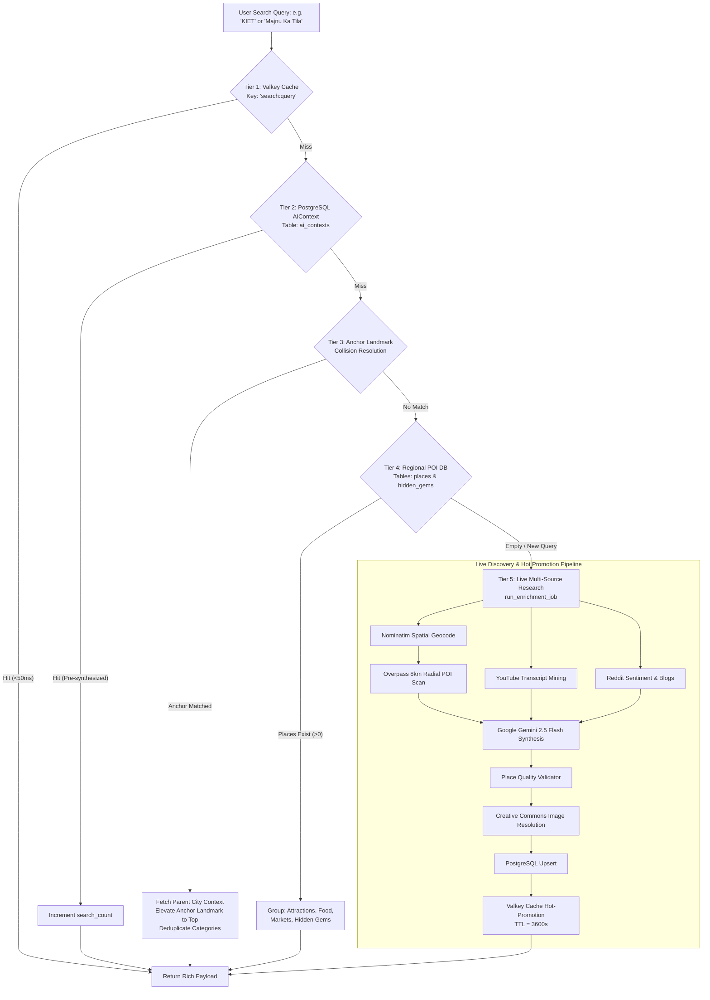
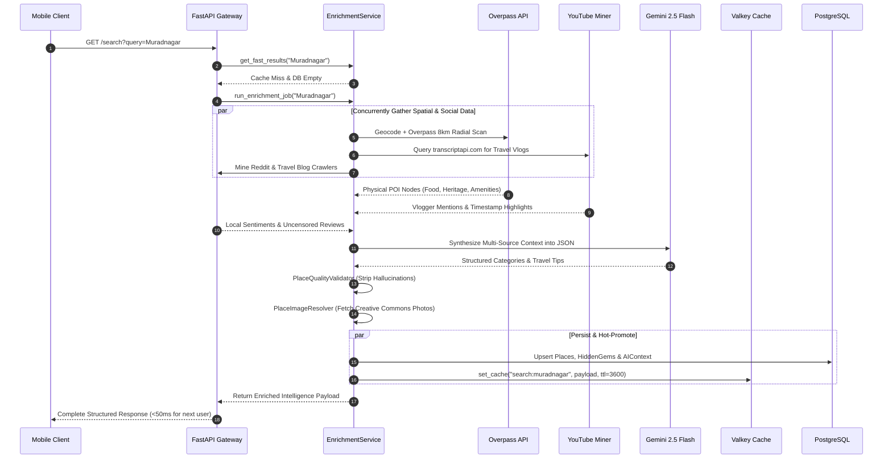

# Decoupled Search & 4-Tier Resolution Architecture

This document breaks down the core discovery engine inside `app/services/enrichment_service.py` and `app/services/search_service.py`, detailing how Ghumo reconciles the tension between sub-50ms query latency and deep, multi-source live intelligence synthesis.

---

## The Latency Paradox in Local Intelligence

Comprehensive travel intelligence requires interrogating multiple disparate systems:
1. **Nominatim**: Forward geocoding to resolve spatial latitude/longitude boundaries (~400ms).
2. **OpenStreetMap Overpass API**: Querying physical nodes and ways within an 8km radius (~1,200ms–2,500ms).
3. **YouTube Transcripts**: Mining timecoded vlogger descriptions and transcripts via `transcriptapi.com` (~800ms–1,500ms).
4. **Reddit & Travel Blogs**: Mining traveler sentiment, student reviews, and hidden spots (~1,000ms).
5. **Google Gemini LLM Reasoning**: Synthesizing raw noisy payloads into structured JSON (~1,800ms–3,000ms).
6. **Creative Commons Image Resolution**: Batch verifying photographic URLs via Wikimedia Commons and Unsplash (~600ms).

Executing this pipeline synchronously takes **6 to 12 seconds**. Forcing a mobile user to wait 10 seconds on a search bar produces unacceptable drop-off. Conversely, returning empty search results for unindexed regions destroys user trust.

Ghumo resolves this through a **Decoupled 4-Tier Resolution Engine** paired with **Asynchronous Hot-Promotion**.

---

## 4-Tier Resolution Flowchart



---

## Detailed Walkthrough of Resolution Tiers

### Tier 1: Valkey / Redis In-Memory Cache
- **Key Pattern**: `search:{normalized_query_string}`
- **TTL Strategy**: 3600 seconds (1 hour) for general search queries; 86400 seconds (24 hours) for heavy YouTube transcript payloads.
- **Latency**: Sub-millisecond retrieval (typically **12ms to 35ms** network round-trip).
- If the cached dictionary contains fully populated categories (`attractions`, `food`, `markets`, `hidden_gems`) and the flag `enriching == false`, the request terminates immediately.

### Tier 2: Persistent PostgreSQL `AIContext`
If Valkey misses (e.g. after container restart or cache expiration), the service queries the `ai_contexts` table in Supabase PostgreSQL:
- Matches on `AIContext.query.ilike(f"%{clean_query}%")`.
- If an existing synthesized record is found with valid `ai_response` JSON:
  1. The server updates `search_count += 1` and `last_searched_at = utcnow()`.
  2. Promotes the payload back to Tier 1 Valkey cache.
  3. Returns the synthesized context to the client in `< 120ms`.

### Tier 3: Anchor Landmark Matching & Collision Resolution
A major architectural flaw in conventional geo-search is the **POI Collision Bug**:
- A user queries a specific institution, college, or temple (e.g., `"KIET Group of Institutions"`).
- Standard city-level queries either find zero records for the college name or return generic landmarks of the parent municipality (e.g. `"Muradnagar"` or `"Ghaziabad"`), burying or omitting the exact landmark requested.

#### The Anchor Landmark Elevation Algorithm (`enrichment_service.py`):
```python
# Check if query matches an exact POI entity in the Place database
matched_poi = db.query(Place).filter(
    Place.name.ilike(f"%{clean_query}%")
).first()

if matched_poi and matched_poi.city:
    parent_city = matched_poi.city
    logger.info(f"Anchor Landmark hit: '{matched_poi.name}' mapped to city: '{parent_city}'")
    
    # 1. Fetch the rich city context for the parent city
    city_context = await self.get_fast_results(parent_city)
    
    # 2. Convert the matched anchor landmark into a high-confidence POI card
    anchor_card = {
        "name": matched_poi.name,
        "type": matched_poi.category or "attraction",
        "description": f"Featured anchor landmark in {parent_city}. High confidence POI match.",
        "lat": matched_poi.lat,
        "lng": matched_poi.lng,
        "confidence_score": 1.0,
        "search_count": (matched_poi.search_count or 0) + 1
    }
    
    # 3. Elevate and prepend the anchor card to the front of attractions/places
    attractions = [anchor_card] + [
        p for p in city_context.get("attractions", []) 
        if p.get("name", "").lower() != matched_poi.name.lower()
    ]
    city_context["attractions"] = attractions
    return city_context
```

### Tier 4: Regional POI Database Aggregation
If no single anchor matches, the service queries the `Place` and `HiddenGem` tables directly:
- Filters records where `Place.city.ilike(f"%{clean_query}%")`.
- Groups records into discrete domain categories:
  - `attractions`: Tourism, monuments, heritage, scenic viewpoints.
  - `food`: Cafes, dhabas, local bakeries, street food hubs.
  - `markets`: Bazaars, handicraft centres, night markets.
  - `hidden_gems`: Curated offbeat entries from `HiddenGem` and `LocalContribution`.

---

## Live Discovery & Hot-Promotion (`run_enrichment_job`)

When all four tiers report a cache/database miss, the service triggers the live research pipeline:



### The 60-Second First-Time Synchronous Wait Loop
To balance the user experience on completely uncached locations:
1. When a client performs a standard `GET /search` for a brand new destination, the endpoint detects that `places` is empty.
2. Rather than returning a blank screen with zero places, it awaits `enrichment_service.run_enrichment_job()` directly up to a safe timeout.
3. For continuous progress indicators, clients use the dedicated **SSE streaming endpoint** (`/search/stream`), which emits live milestones while the background task completes.
