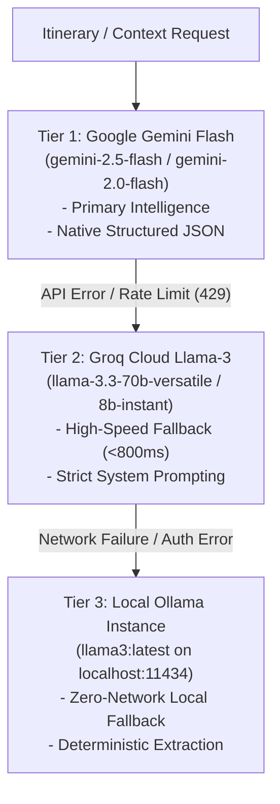
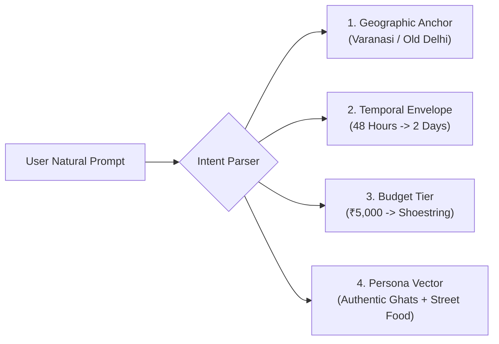
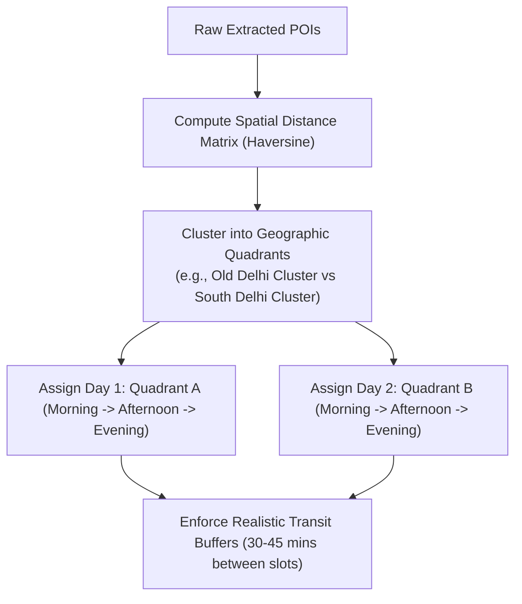

# AI Reasoning Engine & Itinerary Synthesis

This document explores the AI reasoning core powering Ghumo (`app/services/itinerary_service.py`, `app/services/context_reasoning_service.py`, and `app/services/ai_service.py`), detailing prompt engineering strategies, JSON schema guarantees, multi-model fallback cascades, and geo-temporal itinerary chunking.

---

## 1. Multi-Model AI Orchestration Cascade

To guarantee high availability and sub-second reasoning even during vendor outages or rate limit spikes, Ghumo operates a **three-tier LLM fallback hierarchy**:



### Model Selection Rationale
- **Google Gemini 2.5 Flash**: Offers exceptional zero-shot structured JSON adherence and extensive multi-modal reasoning capabilities, allowing long transcript payloads (up to 1 million tokens) to be parsed in a single pass.
- **Groq Cloud (Llama 3.3 70B)**: Serves as an ultra-fast hardware LPUs (Language Processing Units) fallback, delivering token generation speeds exceeding 300 tokens/sec when Gemini throttles.
- **Ollama Local Engine**: Ensures the development environment and air-gapped demo deployments remain functional without external internet connectivity or API keys.

---

## 2. Strict JSON Schema Prompting & Parsing Resiliency

LLMs naturally gravitate towards conversational preambles (e.g. *"Sure! Here is your itinerary:"*) and markdown code blocks (` ```json ... ``` `), which break standard programmatic JSON parsers.

### The System Prompt Architecture
The system injects explicit operational boundaries into the model context:

```python
SYSTEM_PROMPT = """
You are Ghumo AI, an expert local travel intelligence engine and master itinerary architect.
You must return ONLY a valid, parseable JSON object. 
DO NOT include any conversational preamble, intro text, markdown fences (```json or ```), or trailing commentary.

Your output must strictly follow this JSON schema:
{
 "location": "string",
 "summary": "string",
 "duration_days": int,
 "estimated_budget": {
 "currency": "INR",
 "tier": "Budget | Moderate | Luxury",
 "range": "string"
 },
 "cultural_lore_and_etiquette": [
 "string"
 ],
 "best_times_and_photography": {
 "golden_hour_spot": "string",
 "cultural_timings": "string"
 },
 "days": [
 {
 "day_number": int,
 "theme": "string",
 "morning": {
 "place_name": "string",
 "description": "string",
 "recommended_activity": "string",
 "duration_minutes": int
 },
 "afternoon": {
 "place_name": "string",
 "description": "string",
 "culinary_pairing": "string",
 "duration_minutes": int
 },
 "evening": {
 "place_name": "string",
 "description": "string",
 "sunset_viewpoint": "string",
 "duration_minutes": int
 }
 }
 ]
}
"""
```

### The Defensive JSON Sanitizer (`ai_service.py`)
To neutralize edge-case formatting defects, raw responses pass through a regex sanitizer before JSON decoding:

```python
def clean_llm_json_response(raw_text: str) -> dict:
 # 1. Strip markdown code fences if present
 cleaned = re.sub(r"^```(?:json)?\s*", "", raw_text.strip(), flags=re.MULTILINE)
 cleaned = re.sub(r"\s*```$", "", cleaned.strip(), flags=re.MULTILINE)
 
 # 2. Locate first '{' and last '}' to eliminate leading/trailing chat
 start_idx = cleaned.find("{")
 end_idx = cleaned.rfind("}")
 if start_idx != -1 and end_idx != -1:
 cleaned = cleaned[start_idx : end_idx + 1]
 
 # 3. Parse JSON with exception handling
 try:
 return json.loads(cleaned)
 except json.JSONDecodeError as err:
 logger.warning(f"Initial JSON parse failed: {err}. Attempting secondary repair...")
 # Optional: Apply JSON repair heuristics (e.g., closing unclosed brackets)
 return json_repair.loads(cleaned)
```

---

## 3. Natural Language Intent Parsing

Users communicate in open-ended natural language:
- *"I have 48 hours in Varanasi with 5000 rupees budget, show me authentic ghats and street food, no tourist traps."*
- *"Weekend trip near Delhi with college friends, cheap chill vibes."*

The parser extracts four multidimensional constraint vectors:



| Dimension | Extracted Values | Synthesis Influence |
| :--- | :--- | :--- |
| **Temporal Envelope** | `half_day`, `1_day`, `2_day`, `3_day+` | Controls the length of the `days` array and pacing between POIs. |
| **Budget Tier** | `Shoestring (<₹1k/day)`, `Moderate`, `Luxury` | Determines dining suggestions (dhabas vs rooftop bistros) and transit modes (metro/auto vs private cab). |
| **Traveler Persona** | `Foodie`, `Heritage`, `Spiritual`, `Backpacker`, `Nightlife` | Filters POI categories, prioritizing culinary hubs or historical monuments. |
| **Pacing Constraint** | `Relaxed (1-2 POIs/day)` vs `Dense (4-6 POIs/day)` | Sets `duration_minutes` per activity and transit buffers. |

---

## 4. Geo-Temporal Itinerary Chunking & Waypoint Clustering

A common defect in naive AI travel planners is **geographic zig-zagging**: scheduling a morning attraction in North Delhi, lunch in South Delhi, and an evening market back in North Delhi, forcing travelers to spend hours in traffic.

### The Spatial Proximity Guard
The synthesis engine clusters waypoints by calculating coordinate bounding boxes:



1. **Morning Slot**: Focused on major historical monuments or spiritual sites before peak crowds and high heat (e.g. early morning boat ride on Dashashwamedh Ghat or sunrise at Taj Mahal).
2. **Afternoon Slot**: Indoor air-conditioned museums, heritage havelis, or landmark culinary pairings (e.g. historic lunch at Karim's or chole bhature at Sita Ram Diwan Chand).
3. **Evening Slot**: Vibrant night markets, sunset viewpoints, or evening Aarti ceremonies (e.g. sunset from Nahargarh Fort or Ganga Aarti).

---

## 5. Deep Contextual Reasoning: Lore, Etiquette & Best Hours

Beyond standard place names, every destination card is enriched with deep cultural intelligence:

- **Golden Hour & Photography Recommendations**: Directs travelers to the exact terrace, viewpoint, or lighting conditions (e.g. *"Capture Humayun's Tomb from the west water channel 45 minutes before sunset for symmetrical red sandstone reflections"*).
- **Cultural Etiquette & Dress Codes**: Explicit warnings regarding head coverings (Gurudwaras), shoe removal, photography restrictions, and modest clothing.
- **Local Culinary Pairings**: Specific dish recommendations tied to the exact neighborhood (e.g. Daulat ki Chaat in Chandni Chowk during winter mornings; Nagori Halwa in Old Delhi).
- **Safety & Scams Avoidance**: Guidance on auto-rickshaw fare meters, fake guide solicitations, and neighborhood curfews.
