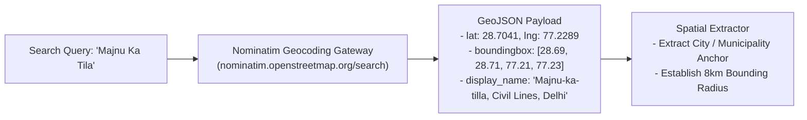
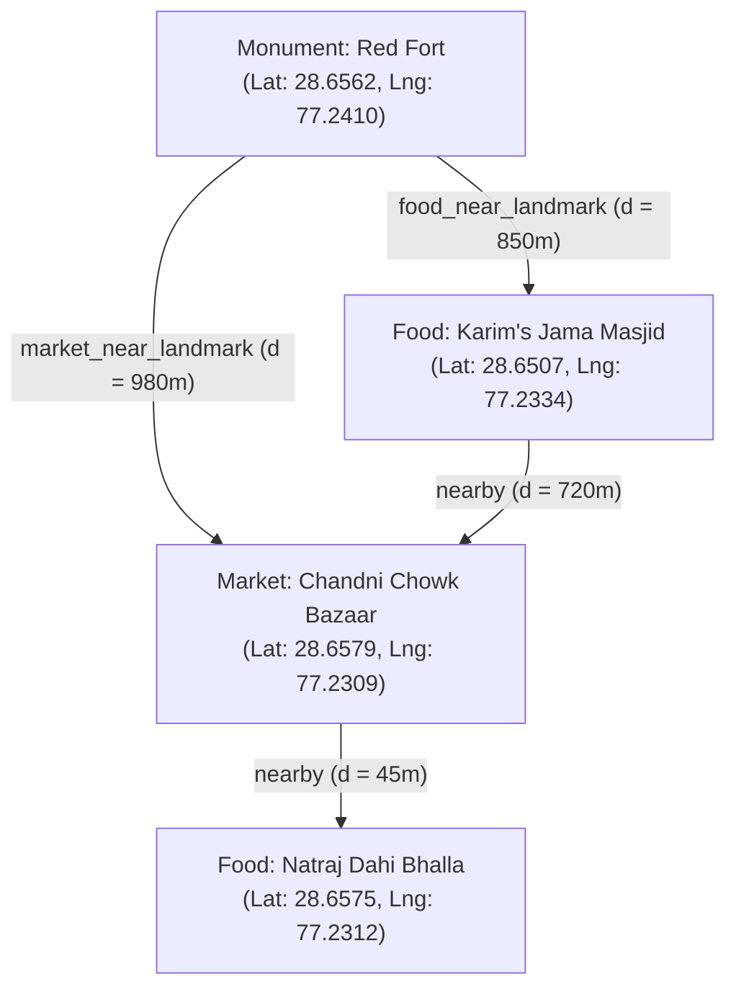

# Geospatial Pipeline, Overpass API & Knowledge Graph

This document details the spatial foundations of Ghumo (`app/services/osm_service.py`, `app/services/knowledge_graph_service.py`, and `app/services/opentripmap.py`), covering OpenStreetMap integrations, physical landmark scanning, Haversine relational computation, and graph entity linking.

---

## 1. OpenStreetMap Nominatim Geocoding Pipeline

Geographic coordinates form the foundational anchor for all Ghumo subsystems. The system relies on **Nominatim** for both forward and reverse geocoding:



### Nominatim Usage Policy & Compliance
To guarantee zero service suspensions or 403 Forbidden bans:
1. **Custom Compliant User-Agent**: Transmits descriptive header identifying the application:
 `User-Agent: GhumoTravelApp/1.0 (contact: vpratapsingh099@gmail.com)`
2. **Result Caching**: Geocoded bounding boxes and coordinates are cached in Valkey under `geocode:{query}` with a 7-day TTL, drastically minimizing external outbound calls.

---

## 2. Overpass API 8km Radial Spatial Scanner

When an uncached destination requires physical landmark indexing, Ghumo constructs an **Overpass QL** query centered on the target coordinate with an **8,000-meter (8km) radius**:

```overpass
[out:json][timeout:25];
(
 node["amenity"~"restaurant|cafe|fast_food|food_court"](around:8000, 28.7041, 77.2289);
 node["tourism"~"attraction|museum|viewpoint|artwork|hotel"](around:8000, 28.7041, 77.2289);
 node["historic"~"monument|memorial|ruins|castle|archaeological_site"](around:8000, 28.7041, 77.2289);
 node["shop"~"mall|convenience|bakery|supermarket"](around:8000, 28.7041, 77.2289);
);
out body 60;
>;
out skel qt;
```

### Why 8 Kilometers?
- **City Density Matching**: In Indian urban clusters (NCR, Delhi, Jaipur, Varanasi), an 8km radius encompasses the complete historical core and adjoining transit hubs without capturing unrelated distant districts.
- **Payload Bound**: Limits the returned GeoJSON payload to < 200KB, preventing memory saturation and keeping parsing times under **1.8 seconds**.

### Node Categorization Engine
Nodes returned by Overpass are automatically classified into discrete application domains:

| OSM Tag Pattern | Ghumo Domain Category | UI Card Icon & Color |
| :--- | :--- | :--- |
| `historic=*` or `tourism=attraction\|museum` | `attractions` | Amber `#D4A373` |
| `amenity=restaurant\|cafe\|fast_food` | `food` | Crimson `#E76F51` |
| `shop=mall\|market` or `amenity=marketplace` | `markets` | Emerald `#2A9D8F` |
| `tourism=viewpoint` or unclassified gems | `hidden_gems` | Purple `#9D4EDD` |

---

## 3. Spatial Knowledge Graph (`knowledge_graph_service.py`)

A list of disconnected points of interest provides poor guidance for day-wise itinerary planning. The **Knowledge Graph Service** computes relationships between places in a city to model real-world travel connectivity.



### Mathematical Haversine Distance Engine
To calculate distance between coordinates $(\phi_1, \lambda_1)$ and $(\phi_2, \lambda_2)$ without expensive external API calls, the service computes the Haversine formula in Python:

$$\Delta\phi = \phi_2 - \phi_1, \quad \Delta\lambda = \lambda_2 - \lambda_1$$

$$a = \sin^2\left(\frac{\Delta\phi}{2}\right) + \cos(\phi_1)\cos(\phi_2)\sin^2\left(\frac{\Delta\lambda}{2}\right)$$

$$c = 2 \cdot \operatorname{atan2}\left(\sqrt{a}, \sqrt{1 - a}\right)$$

$$d = R \cdot c \quad \text{where } R = 6{,}371{,}000\text{ meters}$$

### Entity Edge Taxonomy
The system populates the `PlaceRelation` table with typed spatial and contextual edges:

1. **`nearby`**: Assigned when $d \le 500\text{ meters}$. Used by the frontend to display *"Walkable in 5 mins"* badges.
2. **`food_near_landmark`**: Links high-confidence dining spots within $1.5\text{ km}$ of a major cultural monument, answering the traveler's question: *"Where do I eat after visiting this fort?"*
3. **`market_near_landmark`**: Links vibrant shopping bazaars within $2.0\text{ km}$ of daytime attractions.
4. **`video_mention`**: Contextual edge connecting physical places mentioned together in the same YouTube vlog segment.

### Graph Traversal API: `GET /graph/related/{place_id}`
Returns all neighboring places, grouped by relationship type with precomputed walking distances:

```json
{
 "place_id": 104,
 "place_name": "Humayun's Tomb",
 "relations": [
 {
 "related_place_id": 218,
 "name": "Sunder Nursery Heritage Park",
 "relation_type": "nearby",
 "distance_meters": 420,
 "walk_time_minutes": 5
 },
 {
 "related_place_id": 305,
 "name": "Nizamuddin Dargah Kebab Stalls",
 "relation_type": "food_near_landmark",
 "distance_meters": 950,
 "walk_time_minutes": 12
 }
 ]
}
```

---

## 4. OpenTripMap Enrichment (`opentripmap.py`)

For globally recognized monuments and heritage locations, the backend enriches the raw OpenStreetMap entity with structured metadata from **OpenTripMap**:
- **Wikidata / Wikipedia References**: Extracts verified historical lore, architectural style, and founding century.
- **Popularity & Rating Scoring**: Attaches global traveler popularity rank to calibrate the initial confidence score before local sentiment analysis.
