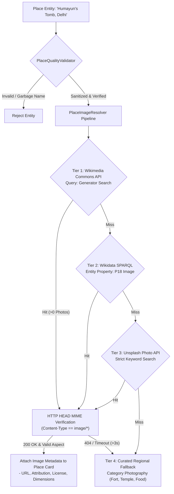

# Place Quality Validation & Creative Commons Image Pipeline

This document details the data integrity and visual resolution subsystems of Ghumo (`app/services/place_quality_validator.py` and `app/services/place_image_resolver.py`), explaining how the platform prevents AI hallucinations and resolves authentic Creative Commons photographs without expensive third-party image APIs.

---

## 1. The Zero-Hallucination Visual Imperative

When modern AI travel apps integrate generative image models (DALL-E, Midjourney, Imagen), they frequently generate **fictional fantasy representations** of real-world historical sites:
- An AI image of *India Gate* might display five minarets or gothic spires.
- An AI image of *Varanasi Ghats* might depict Mediterranean villas.

For an engineering-grade travel companion, synthetic visual hallucinations destroy user credibility. Conversely, querying commercial image APIs (like Google Places Photos API) incurs heavy billing costs ($7.00 per 1,000 photo references), quickly exhausting infrastructure budgets.

Ghumo adheres to a **Zero-Hallucination Visual Architecture**:
1. All images are **100% authentic, real-world photographs**.
2. Photos are resolved dynamically through open-access **Creative Commons** repositories (Wikimedia Commons, Wikidata) and royalty-free photographic APIs (Unsplash).
3. Every image URL undergoes automated HTTP HEAD header verification before being dispatched to client UI cards.



---

## 2. Place Quality Validator Heuristics (`place_quality_validator.py`)

Noisy open-source data streams frequently contain incomplete, malformed, or placeholder POI records. The `PlaceQualityValidator` applies three defensive validation stages:

### 1. Blacklist Filtering & Garbage Elimination
Entities matching generic or unhelpful names are immediately rejected:

```python
GARBAGE_PATTERNS = [
 r"^point of interest$",
 r"^unnamed$",
 r"^n/?a$",
 r"^unknown$",
 r"^\d+$", # Pure numeric strings (e.g. "12345")
 r"^shop$",
 r"^commercial building$",
 r"^metro pillar \d+$"
]
```

### 2. Geographic Boundary & Sanity Checks
- Rejects null coordinate pairs `(0.0, 0.0)`.
- Validates latitude $\in [-90.0, 90.0]$ and longitude $\in [-180.0, 180.0]$.
- Verifies that discovered landmarks reside within reasonable geographic proximity to the queried parent city (rejecting rogue Overpass nodes located thousands of kilometers away).

### 3. Canonical Name Normalization & Deduplication
To prevent duplicate cards when multiple sources report slightly different names (e.g., *"Karim's Restaurant"*, *"Karim Hotel"*, *"Karim's Historic Mughlai"*):
- Lowercases strings and strips punctuation.
- Removes stop words: `["restaurant", "hotel", "cafe", "dhaba", "shop", "near", "road", "street"]`.
- Generates a canonical fingerprint: `"karim"`.
- If an entity with the same canonical fingerprint already exists in the current result set, the validator merges their metadata, keeping the entry with the higher confidence score.

---

## 3. Multi-Tier Image Resolver Pipeline (`place_image_resolver.py`)

### Tier 1: Wikimedia Commons API
Queries Wikimedia Commons using MediaWiki generator search:
```
https://commons.wikimedia.org/w/api.php?action=query
 &generator=search
 &gsrsearch={place_name}+{city}
 &gsrlimit=3
 &prop=imageinfo
 &iiprop=url|size|extmetadata
 &format=json
```
- Extracts high-resolution direct image URLs (`imageinfo[0].url`).
- Preserves artist credit and Creative Commons license terms (`CC-BY-SA 4.0`, `CC0 Public Domain`) for attribution display in the modal detail sheet.

### Tier 2: Wikidata SPARQL Entity Lookup
For major national monuments (e.g. *Qutub Minar* or *Taj Mahal*), the resolver queries the official Wikidata entity to extract its canonical photograph (Property `P18`):
```sparql
SELECT ?image WHERE {
 ?item rdfs:label "Qutub Minar"@en;
 wdt:P18 ?image.
} LIMIT 1
```

### Tier 3: Unsplash Photo API
If Wikimedia yields zero hits (common for modern student cafes or newly opened micro-breweries):
- Queries Unsplash API with verified place category and city tags.
- Returns professional, high-aesthetic photography optimized for web and mobile delivery.

### Tier 4: Curated Regional Category Photographic Fallbacks
If all external network queries fail or timeout:
- Selects an authentic, high-resolution regional photograph from Ghumo's curated offline asset registry matched to the place's exact category:
 - `heritage`: High-resolution photograph of Mughal red sandstone architecture.
 - `food`: Authentic photograph of sizzling tandoori and street spices.
 - `nature`: Verdant greenery or sunset riverbank.

---

## 4. Concurrent Batch Verification & Aspect Ratio Preservation

### Asynchronous Network Batching
When an itinerary or search query returns 15 distinct places, running image queries sequentially would introduce 6 seconds of latency.

The resolver groups places into an `asyncio.gather` batch:
```python
async def resolve_places_batch(places: list, city: str = "", timeout: float = 3.5):
 tasks = [
 resolve_single_place(place, city=city, timeout=timeout)
 for place in places
 ]
 # Execute all image searches concurrently with global timeout guard
 await asyncio.gather(*tasks, return_exceptions=True)
```

### HTTP HEAD Health Verification
Before returning an image URL to the frontend:
1. Executes a non-blocking `HEAD` request with a **2.0-second timeout**.
2. Checks HTTP response status `200 OK`.
3. Verifies `Content-Type` header matches `image/jpeg`, `image/png`, or `image/webp`.
4. Discards broken links or 403 Forbidden hotlink-protected assets, falling back gracefully to Tier 4.
