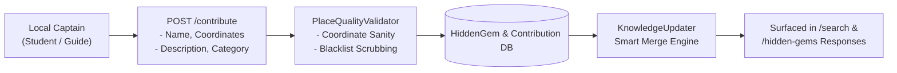

# Local Captain Crowdsourcing & Bayesian Confidence

This document details the crowdsourcing mechanisms and mathematical confidence scoring models powering Ghumo (`app/services/knowledge_updater.py` and `app/services/feedback_service.py`), explaining how community inputs, multi-source citations, and Bayesian smoothing converge to maintain high data quality.

---

## 1. The "Local Captain" Crowdsourcing Philosophy

While automated web crawlers and OpenStreetMap capture physical infrastructure, the most memorable travel experiences—such as a late-night rooftop Maggi point near a university campus or an unmarked sunset cliff behind an ancient stepwell—reside solely in the oral lore of local residents and student travelers.

Ghumo establishes a **Local Captain Contribution Network**:
- Trusted local guides, college students, and backpackers submit offbeat locations via `POST /contribute`.
- Submissions include geographic coordinates, authentic descriptions, recommended hours, and photo evidence.
- Captain submissions bypass mainstream tourist biases, directly populating the `LocalContribution` and `HiddenGem` databases.



---

## 2. Multi-Signal Composite Confidence Formula

Every destination indexed in the `Place` or `HiddenGem` database maintains a dynamic **`confidence_score`** ranging from `0.0` to `1.0`. 

The score is computed through a multi-signal Bayesian weighting formula implemented in `knowledge_updater.py`:

```text
Confidence Score = S_base + W_osm + W_yt + W_reddit + W_blog
```

| Signal Source | Weight (`W`) | Verification Rationale |
| :--- | :---: | :--- |
| **Base AI Hypothesis (`S_base`)** | `0.10` | Baseline prior assigned when an LLM synthesizes a candidate place from conversational context. |
| **OpenStreetMap Verification (`W_osm`)** | `0.40` | Highest single weight. Confirms physical existence as a registered node or way in the global cartographic registry. |
| **YouTube Vlog Mention (`W_yt`)** | `0.20` | Confirms real-world human travel presence with visual and timecoded proof. |
| **Reddit Community Sentiment (`W_reddit`)** | `0.20` | Confirms organic peer endorsement and local recommendation threads. |
| **Travel Blog Citation (`W_blog`)** | `0.10` | Confirms detailed cultural lore and editorial coverage. |

```text
Max Theoretical Score = 0.10 + 0.40 + 0.20 + 0.20 + 0.10 = 1.00
```

Places scoring **≥ 0.70** earn the verified **"Ghumo Recommended"** gold badge in the mobile client.

---

## 3. Bayesian Weighted Rating Smoothing (`feedback_service.py`)

Simple arithmetic averages (`mean = Σx / n`) fail on crowdsourced platforms:
- A new place with a single 5-star rating (`n = 1`) naively outranks a legendary landmark with 4.8 stars across 2,000 ratings (`n = 2000`).
- Malicious actors can easily manipulate ratings by submitting 1-star review bombs.

To prevent this distortion, Ghumo applies **Bayesian Weighted Rating Smoothing** to all community votes submitted via `POST /target-feedback`:

```text
         (v · R) + (m · C)
    W =  ─────────────────
               v + m
```

Where:
- **`W`** = Final Bayesian weighted score.
- **`v`** = Total number of verified community ratings for this target entity.
- **`R`** = Arithmetic average of existing ratings for this entity (in range `[1.0, 5.0]`).
- **`m`** = Minimum rating threshold required for strong weight (tuned to `m = 5` ratings).
- **`C`** = Prior mean rating across the entire geographic region (calibrated to `C = 4.0`).

### Behavioral Dynamics:
1. **Low Vote Count (`v → 0`)**: The score gently gravitates toward the regional baseline prior (`C = 4.0`), preventing rogue entries with one 5-star rating from dominating the top charts.
2. **High Vote Count (`v ≫ m`)**: The influence of the prior `m · C` diminishes, allowing true community consensus (`R`) to dictate the ranking.

---

## 4. Self-Updating Database: The Smart Merge Engine

When background crawlers or community captains report updated information for an existing landmark, the system must avoid data regression.

### The Smart Merge Algorithm (`knowledge_updater.py`)
```python
def smart_merge_place(existing_place: Place, new_data: dict, db: Session):
    old_confidence = existing_place.confidence_score or 0.0
    new_confidence = calculate_confidence(new_data)
    
    # 1. Update core fields ONLY if new confidence exceeds existing confidence
    if new_confidence >= old_confidence:
        existing_place.confidence_score = new_confidence
        if new_data.get("description") and len(new_data["description"]) > len(existing_place.description or ""):
            existing_place.description = new_data["description"]
        if new_data.get("category"):
            existing_place.category = new_data["category"]
            
    # 2. Cumulative increment of source citations
    existing_place.source_count = (existing_place.source_count or 1) + 1
    existing_place.updated_at = datetime.utcnow()
    
    db.commit()
    db.refresh(existing_place)
    return existing_place
```

This guarantee ensures that:
- Rich historical descriptions are never overwritten by low-fidelity crawler snippets.
- High-confidence records remain protected against data corruption.
- As more distinct platforms cite a location, its `source_count` increments, elevating its prominence in the dynamic recommendation engine (`GET /recommendations`).
