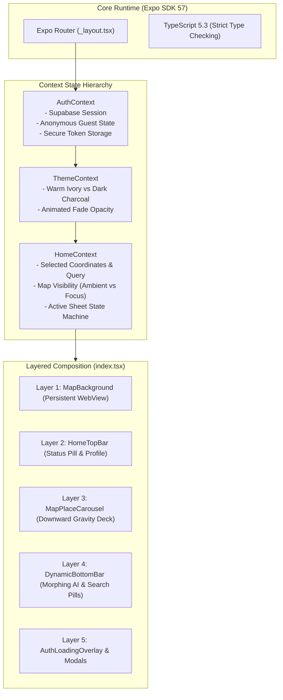

# Frontend Architecture & Expo SDK 57 Foundation

This document details the frontend architecture of Ghumo (`frontend/src/`), exploring its Expo SDK 57 runtime, strict TypeScript domain contracts, multi-context state providers, and cross-platform layout management.

---

## 1. Runtime Foundation & Expo SDK 57 Constraints

The client application is built with **React Native 0.76+** under the **Expo SDK 57** runtime, targeting Web, Android (APK/AAB), and iOS with a single unified codebase.



### Critical SDK 57 Architectural Rules
1. **Safe Area Management**: `SafeAreaView` from the core `react-native` package is deprecated in SDK 57 and causes inconsistent insets across notched devices. Ghumo strictly imports `SafeAreaView` from `react-native-safe-area-context`.
2. **Library Installation Discipline**: Never install native packages with raw `npm install`. Always execute `npx expo install <package>` to guarantee version alignment with SDK 57 binary dependencies.
3. **Type Safety Mandate**: The codebase runs under strict TypeScript compiler rules (`tsconfig.json`), verified via `npx tsc --noEmit`.

---

## 2. Context Providers & State Architecture

Application state is managed through three decoupled React Context providers in `src/context/`:

### 1. `AuthContext.tsx`: Identity & Guest Sessions
- Interfaces with the **Supabase Auth** client.
- Supports instant **Guest Mode**: Allows first-time travelers to immediately plan itineraries and explore maps without compulsory sign-up friction.
- Caches authentication JWTs in device storage, automatically refreshing sessions upon app initialization.

### 2. `ThemeContext.tsx`: Aesthetic Palette & Transition Shaders
Toggles between two curated, high-contrast visual themes:
- **Dark Charcoal Mode** (Default):
  - Screen Background: `#191816` (Deep Obsidian Charcoal)
  - Surface Card: `#252321` (Warm Smoky Quartz)
  - Text Primary: `#FAF8F5` (Alabaster White)
  - Accent / Gold: `#E9B44C` (Antique Gold)
- **Warm Ivory Mode**:
  - Screen Background: `#ECE8E1` (Warm Architectural Ivory)
  - Surface Card: `#FAF8F5` (Pure Milk White)
  - Text Primary: `#191816` (Dark Charcoal)
  - Accent: `#D4A373` (Desert Sand)
- Implements a global `fadeAnim` (`Animated.Value`) that smoothly blends interface elements during theme transitions.

### 3. `HomeContext.tsx`: Spatial State & UI Sheet Coordination
Acts as the central conductor for interactive search and map operations:
- `isMapVisible`: Boolean flag controlling whether the background Leaflet WebView is interactive or blurred.
- `searchQuery` & `activeCategory`: Active search filter parameters.
- `selectedPlace`: The currently highlighted POI card; synchronizes the carousel with the map pin.
- `showExitModal`: Intercepts the Android hardware back button via `BackHandler` on the home screen, presenting the custom `ExitConfirmationModal` rather than abruptly killing the application.

---

## 3. Strict Domain Models (`src/domain/`)

The application enforces end-to-end type safety between the FastAPI backend and React Native frontend:

```typescript
// src/domain/place.ts
export interface Coordinates {
  lat: number;
  lng: number;
}

export interface PlaceImage {
  url: string;
  source: 'wikimedia' | 'wikidata' | 'unsplash' | 'curated';
  attribution?: string;
  license?: string;
}

export interface PlaceSearchResult {
  id?: number | string;
  name: string;
  category: 'attractions' | 'food' | 'markets' | 'hidden_gems';
  city: string;
  lat: number;
  lng: number;
  confidence_score: number;
  description?: string;
  image?: PlaceImage;
  cultural_lore?: string;
  best_time?: string;
  culinary_pairing?: string;
}

export interface ItineraryDay {
  day_number: number;
  theme: string;
  morning: ItineraryActivity;
  afternoon: ItineraryActivity;
  evening: ItineraryActivity;
}
```

---

## 4. Layered Screen Composition (`src/app/index.tsx`)

Rather than unmounting and remounting screens on navigation—which would destroy the active WebGL/Canvas state of the map—`HomeScreen` employs a **6-Layer Stack**:

```tsx
return (
  <Animated.View style={[styles.homeRoot, { backgroundColor: theme.colors.background.screen }]}>
    {/* Layer 1: Background Leaflet Map (Kept mounted to preserve tiles & pins) */}
    <View style={[StyleSheet.absoluteFill, { opacity: isMapVisible ? 1 : 0 }]}>
      <MapBackground />
    </View>

    {/* Layer 1.5: Ambient Ghumo Logo when Map is Hidden */}
    {!isMapVisible && <GhumoCenterBrand />}

    {/* Layer 2: Floating Header Bar (Profile, Connectivity, Theme) */}
    <HomeTopBar />

    {/* Layer 3: Downward Gravity Place Carousel */}
    <MapPlaceCarousel />

    {/* Layer 4: Dynamic Morphing Bottom Sheet Bar */}
    <DynamicBottomBar />

    {/* Layer 5: Asynchronous Loading Overlay */}
    <AuthLoadingOverlay />

    {/* Layer 6: Android Back Exit Confirmation Modal */}
    <ExitConfirmationModal visible={showExitModal} onCancel={() => setShowExitModal(false)} />
  </Animated.View>
);
```

### Architectural Benefits:
- **Zero Map Flicker**: Toggling search sheets does not reload OpenStreetMap tiles.
- **Instant Map Pan/Zoom**: The Leaflet DOM instance persists in memory, allowing `flyTo()` coordinates to execute instantaneously upon search completion.
- **Fluid Keyboard Avoidance**: `KeyboardAvoidingView` cross-platform padding ensures input fields float effortlessly above software keyboards on both iOS and Android.
