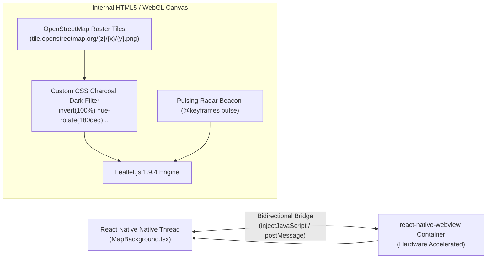
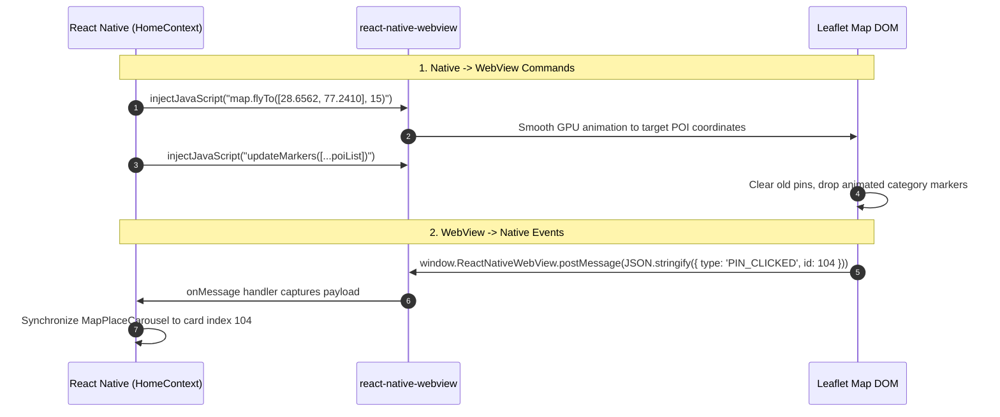

# Zero-Watermark Dark Map & Leaflet.js Pipeline

This document details the spatial rendering engine inside `src/components/home/MapBackground.tsx`, exploring how Ghumo achieves a luxury dark-mode cartographic canvas with zero external API keys, zero watermarks, and zero cloud billing.

---

## 1. The Mobile Map Dilemma

In standard mobile travel applications, developers default to `react-native-maps` backed by Google Maps or Apple Maps. In an Expo Go development and open-source distribution environment, this approach creates severe operational friction:

1. **The Google Cloud Key Wall**: On Android devices running Expo Go, Google Maps displays an empty beige grid unless a valid Google Cloud API key with Maps SDK enabled and billing attached is compiled into the binary.
2. **Restrictive Watermarks & Branding**: Commercial providers force large watermarks, copyright banners, and intrusive vendor logos directly over the viewport.
3. **High Tile Metering Costs**: Mapbox and Google Maps charge steep per-session and per-tile rates ($2.00 to $7.00 per 1,000 dynamic map loads).

### The Ghumo Engineering Solution
Ghumo embeds **Leaflet 1.9.4** inside a native **`react-native-webview`** container fed by official **OpenStreetMap (OSM)** raster tiles.



---

## 2. High-Contrast Dark Charcoal Shaders (CSS Filter Pipeline)

Official OpenStreetMap raster tiles are natively rendered in bright daylight colors (pale yellow roads, glaring white landmasses, bright blue rivers), which clashes violently with modern luxury dark interfaces.

Rather than running an expensive custom vector tile server (e.g. Mapbox GL / Planetiler), Ghumo applies a **hardware-accelerated CSS color inversion shader** directly to Leaflet's tile container:

```css
/* Custom Charcoal Dark Shader injected into MapBackground WebView */
.leaflet-tile-pane {
    filter: invert(100%) hue-rotate(180deg) brightness(85%) contrast(92%);
    -webkit-filter: invert(100%) hue-rotate(180deg) brightness(85%) contrast(92%);
}

/* Background canvas color matching app root */
body, #map {
    background-color: #191816 !important;
    margin: 0;
    padding: 0;
}
```

### Optical Transformation Mathematics:
1. **`invert(100%)`**: Inverts light values, turning stark white landmasses into deep obsidian charcoal (`#191816`) and black typography into clean white text.
2. **`hue-rotate(180deg)`**: Because simple 100% inversion turns blue water bodies into unnatural orange and parks into purple, a 180° hue rotation restores natural optical harmony: rivers and lakes revert to calm deep slate blue, and vegetation reverts to muted dark green.
3. **`brightness(85%) contrast(92%)`**: Softens harsh edge contrast, producing an ultra-premium, glare-free aesthetic suitable for night exploration.

---

## 3. Bidirectional Native-to-WebView JavaScript Bridge

Communication between the React Native JavaScript runtime and Leaflet's DOM context flows over a low-latency bidirectional bridge:



### Native-to-WebView Injection (`injectJavaScript`):
```typescript
const panToLocation = (lat: number, lng: number, zoom = 15) => {
  if (webViewRef.current) {
    webViewRef.current.injectJavaScript(`
      if (window.map) {
        window.map.flyTo([${lat}, ${lng}], ${zoom}, {
          animate: true,
          duration: 1.2
        });
      }
      true;
    `);
  }
};
```

### WebView-to-Native Callback (`onMessage`):
```typescript
const handleWebViewMessage = (event: NativeSyntheticEvent<WebViewMessage>) => {
  try {
    const payload = JSON.parse(event.nativeEvent.data);
    if (payload.type === 'MARKER_SELECTED') {
      setSelectedPlace(payload.place);
      logger.app('Map marker selected by user', payload.place.name);
    }
  } catch (err) {
    logger.error('Failed to parse WebView bridge message', err);
  }
};
```

---

## 4. Glowing Radar User Beacon & Animated POI Markers

### Real-Time GPS User Location Beacon
When the client receives device GPS coordinates from `expo-location`, it injects a custom Leaflet `L.divIcon` displaying a pulsing radar beacon:

```html
<div class="user-beacon-container">
    <div class="radar-pulse"></div>
    <div class="center-dot"></div>
</div>
```

```css
.radar-pulse {
    position: absolute;
    width: 32px;
    height: 32px;
    border-radius: 50%;
    background: rgba(233, 180, 76, 0.4); /* Gold Accent */
    animation: beaconPulse 2s infinite ease-out;
}

@keyframes beaconPulse {
    0% { transform: scale(0.4); opacity: 1; }
    100% { transform: scale(2.2); opacity: 0; }
}

.center-dot {
    width: 12px;
    height: 12px;
    background: #E9B44C;
    border: 2px solid #FAF8F5;
    border-radius: 50%;
}
```

### Category-Themed Animated SVG Pins
Every discovered POI category is rendered with a distinct glowing marker:
- **Attractions**: Amber `#D4A373` SVG pin with monument icon.
- **Food & Dining**: Crimson `#E76F51` pin with bowl icon.
- **Bazaars & Markets**: Emerald `#2A9D8F` pin with shopping bag icon.
- **Hidden Gems**: Royal Purple `#9D4EDD` pin with sparkling diamond icon.
