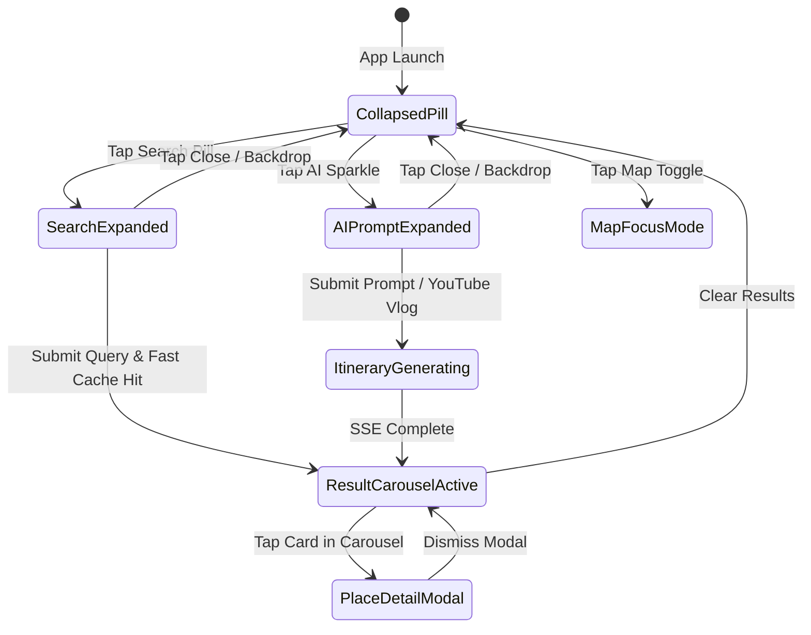
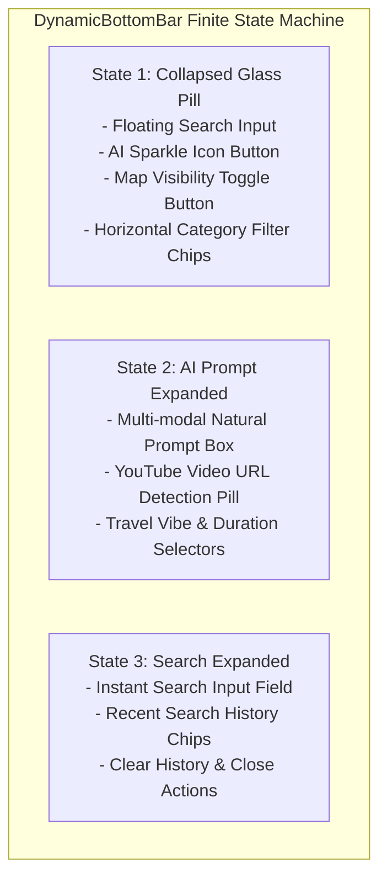
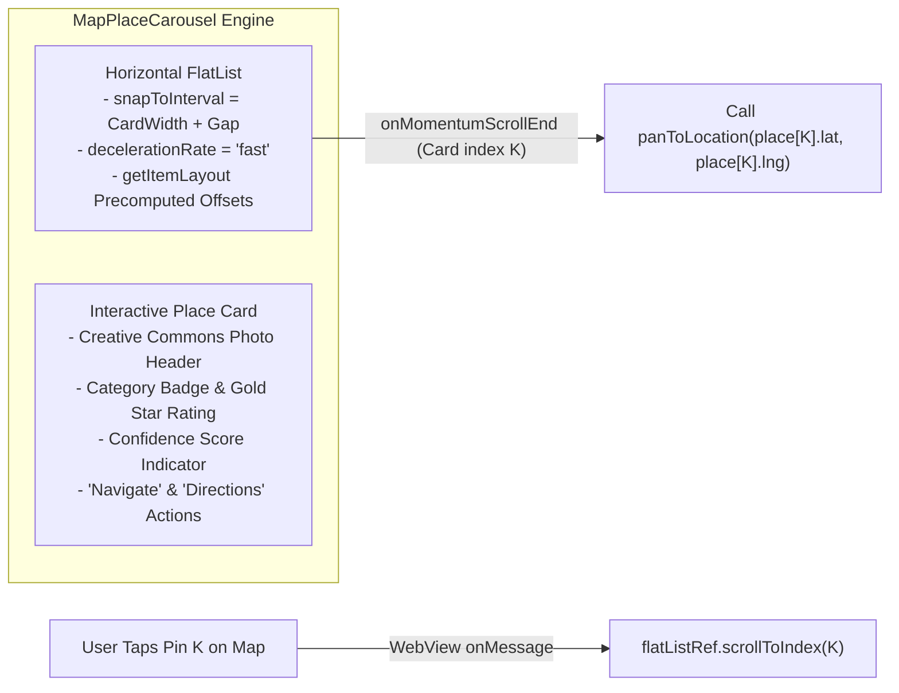

# Dynamic Morphing UI & Interaction Design

This document explores the client-side interaction engine and component architecture (`src/components/home/`), analyzing how Ghumo delivers a fluid, multi-state native experience without jarring screen reloads.

---

## 1. Interaction Design Philosophy: The Ambient Canvas

Most travel applications navigate between rigid, full-page screen hierarchies (Search Page $\to$ Place List Page $\to$ Detail Page $\to$ Fullscreen Map Page). Each transition drops the user's spatial mental model and incurs noticeable loading latency.

Ghumo adheres to the **Ambient Canvas Paradigm**:
1. **The Map is Always Alive**: The Leaflet WebView canvas remains continuously mounted at Layer 1. It is never destroyed or reloaded during user interactions.
2. **Context-Aware Sheet Morphing**: Floating UI elements smoothly expand, collapse, and transform based on user intent.
3. **Downward Gravity Feedback**: Discovered places descend onto the canvas as an interactive carousel deck, keeping the map visible and tactile.

---

## 2. DynamicBottomBar Architecture (`DynamicBottomBar.tsx`)

At over 50KB of optimized React Native logic, `DynamicBottomBar` serves as the primary navigation and action orchestrator:

### Action Controls inside the Collapsed Pill:
1. **Quick Search Pill**: Tap to open the full-screen search drawer with auto-suggestions.
2. **AI Sparkle Button**: Directly expands `PromptView` to generate multi-day custom travel plans or parse YouTube links.
3. **Map Focus Toggle**: Toggles `isMapVisible` between `true` (interactive dark map canvas) and `false` (ambient brand center view).
4. **Category Filter Chips**: Horizontal scrollable list filtering active results on the fly (`All`, `Attractions`, `Food & Dining`, `Markets`, `Hidden Gems`).

---

## 3. Downward Gravity Map Place Carousel (`MapPlaceCarousel.tsx`)

When a search succeeds or an itinerary is generated, discovered landmarks are presented in the **`MapPlaceCarousel`** (48KB).

### Bidirectional Synchronization:
- **Swipe-to-Pan**: Swiping horizontally to a new place card triggers an automatic camera pan (`map.flyTo`) on the Leaflet map, smoothly centering the POI under the user's focus.
- **Tap-to-Scroll**: Tapping any marker pin on the Leaflet map fires a message across the bridge to React Native, automatically scrolling the carousel to highlight the corresponding card.

---

## 4. Multi-Modal Itinerary Builder (`PromptView.tsx`)

`PromptView` (33KB) is engineered to parse open-ended traveler prompts and social media links:

### 1. YouTube Vlog Detection Badge
When a user pastes text containing a YouTube link into the prompt box, a regex detector automatically isolates the URL and renders an interactive **" YouTube Vlog Detected"** chip above the text field.

### 2. Travel Vibe & Budget Pills
Users can configure trip parameters with single-tap pill selectors:
- **Travel Vibes**: `Heritage & History`, `Street Food Walk`, `Budget Student Hangout`, `Relaxed & Slow`, `Nightlife`.
- **Duration**: `Half Day (4h)`, `Full Day (8h)`, `2 Days (Weekend)`, `3+ Days`.
- **Budget**: `Shoestring (<₹1k)`, `Moderate`, `Luxury`.

### 3. Real-Time Generation Progress Streaming
During itinerary synthesis, `PromptView` renders real-time streaming progress pills derived from backend SSE milestones:
- `Step 1`: *"Parsing travel prompt and extracting constraints..."*
- `Step 2`: *"Scanning OpenStreetMap landmarks within 8km..."*
- `Step 3`: *"Reasoning cultural etiquette and food pairings with Gemini..."*
- `Step 4`: *"Compiling day-wise itinerary map pins..."*

---

## 5. API Calling Discipline & Performance Rules

To prevent aggressive outbound queries and IP throttling against backend services:

1. **Zero Typing Debounce**: Search requests **never** fire while the user is actively typing in the search bar. Searches only execute on explicit user submission (pressing Enter on the keyboard or tapping the search icon).
2. **Zero Mount Auto-Fetch**: Components do not trigger automatic search calls inside mount `useEffect` hooks.
3. **Image Prefetching**: Carousel card images are prefetched via `Image.prefetch(url)` only after the result payload is committed to memory.
