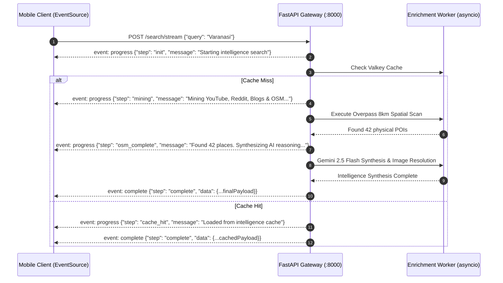
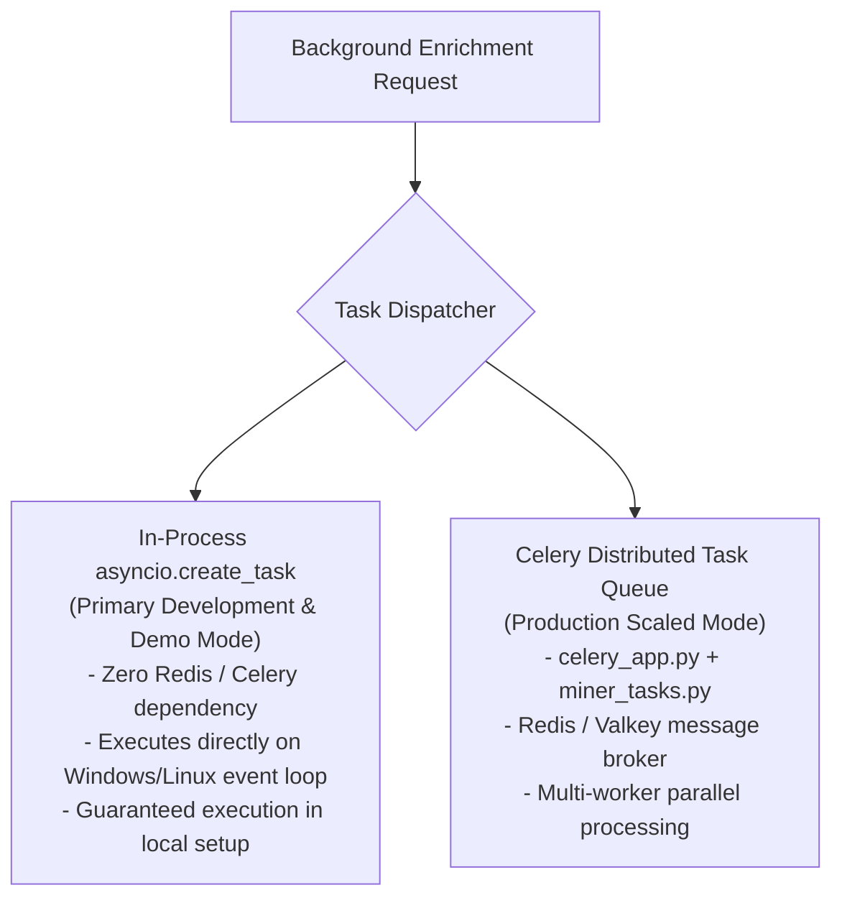

# Real-Time SSE Streaming & Background Task Orchestration

This document details the real-time event streaming protocols and asynchronous task infrastructure of Ghumo (`app/api/router.py`, `app/tasks/miner_tasks.py`, and `app/services/discovery_agent.py`), explaining how progressive intelligence milestones are delivered to clients without blocking HTTP threads.

---

## 1. Why Server-Sent Events (SSE) Over WebSockets?

When executing deep travel research across OpenStreetMap, YouTube, and Gemini LLMs (which requires 5 to 10 seconds), traditional HTTP request-response patterns force the user to stare at a static freeze spinner.

While WebSockets provide bidirectional full-duplex communication, they introduce heavy state management, heartbeat ping-pong frames, and proxy traversal complications. Because search and itinerary generation are **unidirectional server-to-client event progressions**, Ghumo uses **Server-Sent Events (SSE)** via `StreamingResponse(media_type="text/event-stream")`.



---

## 2. SSE Milestone Lifecycle Specification

The streaming endpoints (`/search/stream` and `/itinerary/stream`) emit typed SSE frames complying with the W3C EventSource standard:

| Milestone Event | Step Identifier | Payload Contents | Client UI Representation |
| :--- | :--- | :--- | :--- |
| `event: progress` | `init` | `{"step": "init", "message": "..."}` | Initializes loading shimmer and shows search query badge. |
| `event: progress` | `cache_hit` | `{"step": "cache_hit"}` | Flashes green cached badge; immediate transition to completion. |
| `event: progress` | `mining` | `{"step": "mining", "job_id": "..."}` | Displays *"Mining YouTube vlogs, Reddit threads & travel blogs..."* |
| `event: progress` | `osm_complete` | `{"step": "osm_complete", "data": {...}}` | Drops initial physical landmark pins onto the Leaflet map immediately while AI reasoning continues. |
| `event: progress` | `researching` | `{"step": "researching", "attempt": N}` | Incremental progress ticks indicating active LLM token synthesis. |
| `event: complete` | `complete` | `{"step": "complete", "data": {...}}` | Closes stream; renders full carousel deck, cultural lore, and day-by-day itineraries. |

---

## 3. Non-Blocking Asyncio vs Celery Worker Architecture

A critical design requirement for developer ergonomics and evaluation is that **the backend must function fully out of the box without requiring external worker daemons**.

Ghumo implements a **Dual-Mode Execution Architecture**:



### In-Process `asyncio.create_task` Implementation:
```python
# app/api/router.py
task_name = f"context_enrichment_{search_query}"
job_id = await job_manager.create_job(task_name)

# 1. Non-blocking in-process task (runs reliably on all environments)
asyncio.create_task(enrichment_service.run_enrichment_job(search_query, lat, lng))

# 2. Celery queue dispatch (attempted opportunistically)
try:
 context_enrichment_task.apply_async(args=[job_id, search_query, lat, lng], task_id=job_id)
except Exception as celery_err:
 logger.debug(f"Celery task enqueue skipped (running via asyncio): {celery_err}")
```

---

## 4. Autonomous Discovery Agent & Anti-Ban Jitter (`discovery_agent.py`)

To pre-seed the database with high-value travel data without manual searches, Ghumo includes an autonomous **Discovery Agent**:

### 1. 300+ City Registry
Maintains an indexed registry of cities, pilgrimage centers, hill stations, and NCR college hubs across India:
- Tier 1 Metros: Delhi, Mumbai, Bengaluru, Kolkata, Chennai.
- Cultural & Heritage Hubs: Varanasi, Jaipur, Agra, Hampi, Udaipur, Amritsar.
- NCR Education & Tech Clusters: Ghaziabad, Muradnagar, Noida Sector 62, Greater Noida, Gurgaon CyberHub.

### 2. Anti-Ban Randomized Jitter Algorithm
Scraping external APIs (Overpass, YouTube, Reddit) too rapidly triggers IP bans and HTTP 429 rate limits. The Discovery Agent incorporates **randomized delay jitter**:

```python
class DiscoveryAgent:
 async def run_discovery_loop(self):
 while self.is_running:
 target_city = self.registry.get_next_unseeded_city()
 logger.info(f"[DiscoveryAgent] Starting discovery crawl for: {target_city}")
 
 try:
 await enrichment_service.run_enrichment_job(target_city)
 except Exception as err:
 logger.error(f"[DiscoveryAgent] Crawl failed for {target_city}: {err}")
 
 # Randomized jitter: Sleep 10 to 20 minutes between city jobs
 jitter_seconds = random.randint(600, 1200)
 logger.info(f"[DiscoveryAgent] Sleeping for {jitter_seconds // 60} minutes to protect API quotas...")
 await asyncio.sleep(jitter_seconds)
```

This prevents crawler fingerprinting, distributes network load evenly, and steadily populates the Supabase database with verified places over time.
