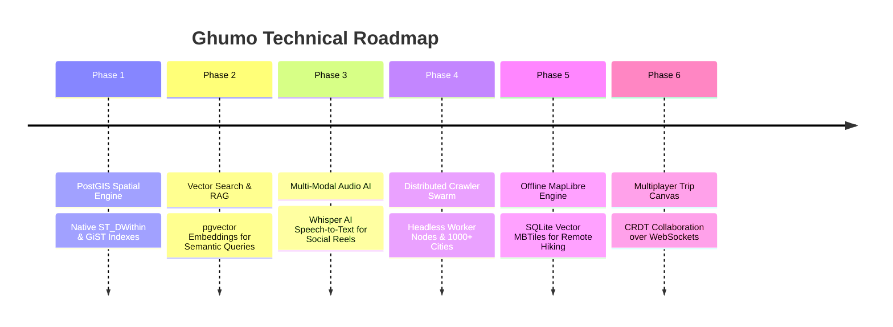
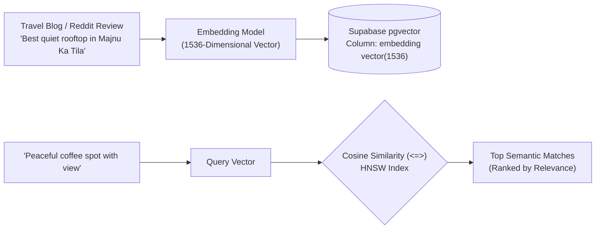

# Scaling Architecture & Future Engineering Roadmap

This document outlines the planned technical evolution, algorithmic upgrades, and infrastructure scaling measures for Ghumo across both Backend and Frontend domains.

---

## Strategic Evolution Timeline



---

## Phase 1: Native PostGIS Spatial Database Migration

### Current Architectural State
Currently, spatial distance calculations (`nearby`, `food_near_landmark`) execute in application memory using pure Python Haversine math (`knowledge_graph_service.py`). While blazing fast for regional clusters (< 500 places per city), this approach requires loading rows into Python memory before distance filtering.

### PostGIS Architecture
We will migrate spatial columns to PostgreSQL native **PostGIS** geometry types with GiST (Generalized Search Tree) spatial indexes:

```sql
-- 1. Enable PostGIS Extension in Supabase / PostgreSQL
CREATE EXTENSION IF NOT EXISTS postgis;

-- 2. Add Native WGS84 Spatial Geometry Column
ALTER TABLE places ADD COLUMN geom geometry(Point, 4326);

-- 3. Populate Geometry from Latitude & Longitude
UPDATE places SET geom = ST_SetSRID(ST_MakePoint(lng, lat), 4326);

-- 4. Create R-Tree Spatial Index for Sub-10ms Radial Queries
CREATE INDEX idx_places_geom_gist ON places USING GIST (geom);
```

### High-Throughput Radial Query:
```sql
-- Sub-millisecond lookup of all food spots within 1.5km of Red Fort
SELECT name, category, ST_Distance(geom, ST_SetSRID(ST_MakePoint(77.2410, 28.6562), 4326)::geography) AS distance_meters
FROM places
WHERE ST_DWithin(geom::geography, ST_SetSRID(ST_MakePoint(77.2410, 28.6562), 4326)::geography, 1500)
 AND category ILIKE '%food%'
ORDER BY distance_meters ASC
LIMIT 10;
```
This reduces radial search latency from ~45ms to **< 3ms**, scaling effortlessly across millions of POIs.

---

## Phase 2: Vector Search & Semantic RAG (`pgvector` / Qdrant)

### The Semantic Gap
Standard keyword search fails when travelers express nuanced desires rather than explicit place names:
- *"Quiet aesthetic rooftop cafe in Old Delhi to read a book with good wifi."*
- *"Spiritual sunset viewpoint away from loud commercial crowds."*

### Vector Embedding Pipeline
We will implement semantic vector embeddings generated via `text-embedding-3-small` or open-source HuggingFace models:



```sql
-- Create vector cosine distance index using HNSW (Hierarchical Navigable Small World)
CREATE INDEX idx_places_embedding_hnsw ON places 
USING hnsw (embedding vector_cosine_ops);
```

---

## Phase 3: Multi-Modal Audio Transcription (Whisper AI)

### Short-Form Video Without Subtitles
A significant percentage of travel recommendations on Instagram Reels and TikTok lack closed captions or descriptive text, featuring only audio voiceovers or on-screen text.

### The Speech-to-Text Extraction Pipeline:
1. **Audio Extraction**: Use `yt-dlp` to extract the 128kbps audio track (`.m4a` / `.mp3`) without downloading video streams, minimizing server bandwidth.
2. **OpenAI Whisper AI Transcription**: Process the audio chunk through `whisper-large-v3` with Indian accent and Hindi/Hinglish language tuning.
3. **Vision LLM Signboard OCR**: For videos without voiceover, sample keyframes at 2 FPS and pass them through Gemini Vision to extract storefront names from background neon signs and menus.

---

## Phase 4: Distributed Crawler Swarm

To scale autonomous discovery from 300 Indian cities to **10,000+ destinations worldwide**:
- Deploy containerized Celery worker nodes orchestrated via Kubernetes across geographically diverse regions.
- Route requests through rotating residential proxy pools to bypass regional rate limiting and IP blocks.
- Implement automated schema migrations that dynamically learn regional categories (e.g. *"Baori"* in Rajasthan, *"Ghat"* in Uttar Pradesh, *"Boulangerie"* in France).

---

## Phase 5: Offline Vector Tiles with MapLibre Native

### The Remote Travel Constraint
In the Himalayas, Rajasthan desert dunes, or remote national parks, travelers frequently lose cellular reception, causing web-based map tiles to fail.

### MapLibre Native Integration:
1. Replace WebView raster tiles with **MapLibre Native** (`@maplibre/maplibre-react-native`).
2. Package pre-rendered vector tiles (`.mbtiles`) inside local SQLite containers on the device.
3. Allow travelers to download a 50MB regional bundle before their trip, enabling full vector zoom, pin discovery, and turn-by-turn routing with **zero cellular connectivity**.

---

## Phase 6: Collaborative Real-Time Group Trip Planning (CRDTs)

Travel planning is fundamentally social. We plan to introduce real-time multiplayer itinerary collaboration:
- Integrate **Conflict-free Replicated Data Types (CRDTs)** using `Yjs` or `Automerge`.
- Sync state over binary WebSockets with operational transforms, allowing multiple friends on different phones to add, delete, and reorder itinerary days simultaneously with instant optimistic UI updates and zero merge conflicts.
