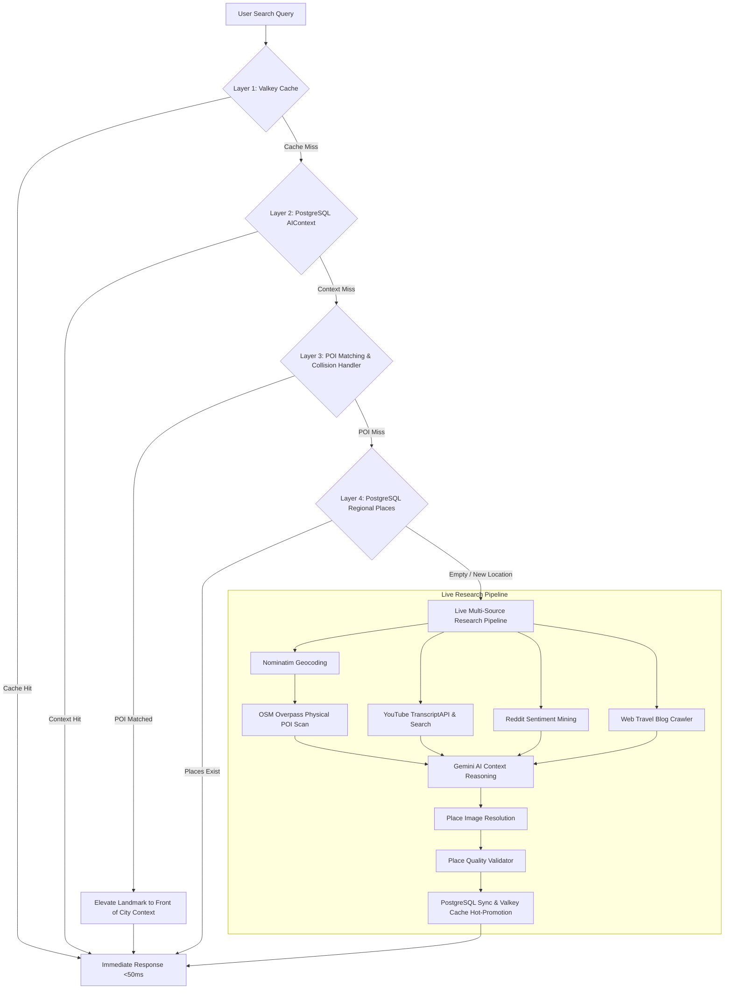

# Ghumo Backend Architecture: Local Intelligence Engine

This document provides a technical overview of the Ghumo backend, functioning as a **Hybrid Local Intelligence & Travel Synthesis Engine**.

---

## 🚀 Architectural Overview: Fast-Cache & Live Synthesis

The system utilizes a hybrid model balancing instant retrieval (< 50ms) for known and seeded places with live multi-source research for new queries.

---

## 🏗 Component Breakdown

### 1. Multi-Tier Resolution & Conflict Handling (`app/services/enrichment_service.py`)
- **Layer 1: Valkey Cache**: Sub-millisecond lookup for frequently searched destinations.
- **Layer 2: Persistent AIContext**: Historical syntheses stored in PostgreSQL with search count tracking.
- **Layer 3: Anchor Landmark Matching & Collision Resolution**:
  - Matches specific POIs (e.g. `KIET Group of Institutions`) against database records.
  - When a query targets a specific college, temple, or landmark, it fetches the surrounding city context (e.g. `Muradnagar`), prepends the matched anchor landmark at the front of its category, and avoids collisions with stale or duplicate records.
- **Layer 4: Regional POI Lookup**: Groups stored landmarks into `attractions`, `food`, `markets`, and `hidden_gems`.

### 2. Live Discovery Pipeline (`run_enrichment_job`)
When a query is completely new or un-enriched:
- **No Blocking Polling Loops**: Directly executes an in-process asyncio pipeline rather than relying on external worker queues.
- **OpenStreetMap / Overpass**: Scans physical landmarks and amenities within an 8km radius using compliant HTTP request headers (`User-Agent`, `Accept`).
- **YouTube Transcripts**: Queries `transcriptapi.com` with API key authentication, extracting vlogger itineraries and tips, cached for 24 hours.
- **Reddit & Blog Sentiment**: Extracts local tips, warnings, and authentic food recommendations.
- **Gemini AI Synthesis**: Synthesizes multi-source data into structured, validated JSON categories.
- **Hot-Promotion**: Saves verified results to PostgreSQL and promotes to Valkey cache.

### 3. Place Quality & Image Resolution
- **Quality Validator** (`app/services/place_quality_validator.py`): Strips generic/placeholder names (`unknown`, `n/a`, `point of interest`), verifies coordinate boundaries, and deduplicates canonical names.
- **Image Resolver** (`app/services/place_image_resolver.py`): Zero AI hallucinated images. Resolves high-resolution Creative Commons photos via Wikimedia Commons, Wikidata, and Unsplash API.

---

## 🔄 Data Scoring & Confidence
Each `Place` and `HiddenGem` maintains a composite `confidence_score`:
- **OSM Presence** (+0.4)
- **YouTube Mentions** (+0.2)
- **Reddit Mentions** (+0.2)
- **Blog Mentions** (+0.2)
- **Community Bayesian Feedback** (1-5 Star weighted confidence)
