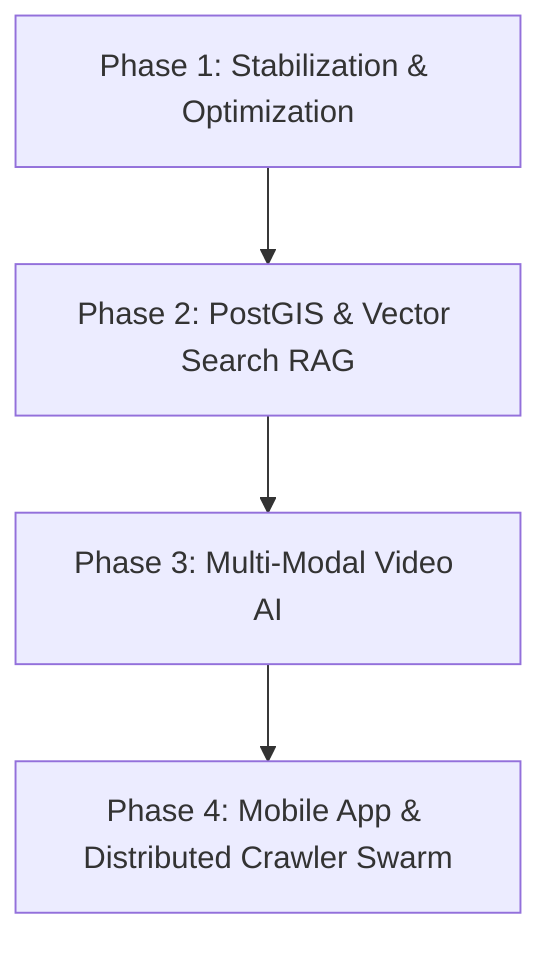

# 🗺️ Ghumo Backend: Complete System Overview & Roadmap

This document presents a comprehensive breakdown of **everything that has been built so far** in the `Ghumo Backend` project, alongside the **planned architecture and future roadmap**.

---

## 🏛️ Executive Summary

**Ghumo Backend** is an AI-powered **Local Intelligence Engine & Travel Discovery Platform** specifically engineered for rich travel exploration, local food recommendations, hidden gem discovery, and itinerary generation (with an initial focus on India and the NCR region).

Unlike traditional travel APIs that return static or empty data, Ghumo utilizes a **Decoupled Architecture**:
1. **Fast Search Layer (<200ms)**: Instant cache/DB response with OSM fallback.
2. **Slow Discovery Layer (Smart & Background)**: Continuous multi-source web mining (Reddit, YouTube, Blogs, OSM) powered by AI reasoning (Groq / Llama 3) and anti-ban rate limiting.

---

## 🛠️ Part 1: What Has Been Done Yet (Implemented Features)

### 1. ⚡ Decoupled Engine Architecture
* **Fast-Search Pipeline (`GET /search`)**:
  * **Layer 1 (Valkey Cache)**: Sub-50ms query cache response (`search:{location}`).
  * **Layer 2 (PostgreSQL AIContext)**: Returns pre-synthesized AI travel context if cached.
  * **Layer 3 (PostgreSQL Places)**: Queries local database for verified POIs by city.
  * **Layer 4 (OSM Fallback)**: Geocodes location and returns base spatial coordinates with an `enriching: true` flag.
  * **Smart 60s First-Time Wait Loop**: For new or shallow locations, the API waits synchronously (up to 60 seconds) polling background tasks so first-time users get rich results immediately rather than empty screens.
* **Background Discovery Agent (`DiscoveryAgent`)**:
  * Runs a background schedule scanning a registry of 300+ cities/landmarks across Delhi, Noida, Gurgaon, Faridabad, Ghaziabad, and NCR.
  * **Rate Limiting & Anti-Ban**: Picks a daily batch of 20 cities with a **10–20 minute randomized jitter** between jobs to protect scrapers and APIs from rate limits or IP bans.

---

### 2. 🌐 Multi-Source Crawling & Social Data Mining
* **OpenStreetMap (OSM Service - `osm_service.py`)**:
  * Overpass API integration querying nodes and ways for amenities, food spots, markets, and historical/tourist attractions.
* **OpenTripMap API Integration (`opentripmap.py`)**:
  * Fetches detailed place metadata, xids, descriptions, and ratings.
* **Reddit Social Mining (`reddit_service.py`)**:
  * Queries Reddit JSON endpoints for travel threads, local food discussions, and raw text posts to capture true local sentiment.
* **YouTube Data & Transcript Mining (`youtube_service.py`)**:
  * Extracts video titles, descriptions, and transcripts using `youtube_transcript_api` to turn travel vlogs into verified place mentions.
* **Indian Travel Blog Scraper & Cloudflare Bypass (`crawlers/`)**:
  * Scrapes travel blogs (Tripoto, IndiTales, local guide sites).
  * Implements `cloudflare_crawler.py` and `cloudflare_service.py` to bypass anti-bot protections and extract raw HTML into `raw_scrapes`.
* **Social Video Itinerary Mining (`POST /itinerary/video`)**:
  * Accepts Instagram Reels, TikTok, YouTube Shorts, or Facebook video URLs (`social_mining.py`).
  * Extracts transcripts, video metadata, or title hints via DuckDuckGo fallback, then uses AI to turn the clip into a complete, structured travel itinerary.

---

### 3. 🧠 AI Reasoning & Smart Merge Knowledge Engine
* **Groq & Llama-3 Synthesis (`context_reasoning_service.py`, `groq_reasoning_service.py`, `ai_service.py`)**:
  * Combines noisy data from OSM, Reddit, YouTube, and Blogs into structured JSON containing top places, food recommendations, markets, hidden gems, and travel tips.
* **Multi-Signal Confidence Scoring (`KnowledgeUpdater`)**:
  * Scores every discovered location from `0.0` to `1.0`:
    $$\text{Confidence Score} = \text{Base AI Score (0.1)} + \text{OSM (0.4)} + \text{Reddit (0.2)} + \text{Blog (0.2)} + \text{YouTube (0.2)}$$
* **Self-Updating Database (Smart Merge)**:
  * Records are updated in the database **only if the new confidence score exceeds existing data**, preventing regression and incrementally building higher data quality over time.

---

### 4. 🕸️ Spatial & Categorical Knowledge Graph
* **Knowledge Graph Service (`knowledge_graph_service.py`)**:
  * Computes Haversine distances between places in a city.
  * Automatically establishes entity relations:
    * `nearby` (distance < 500m)
    * `food_near_landmark` (restaurants near attractions)
    * `market_near_landmark` (markets near tourist spots)
    * `video_mention`, `reddit_mention`, `blog_mention` (social proof links)
  * Exposed via `GET /graph/related/{place_id}`.

---

### 5. 👨‍✈️ Crowdsourced "Local Captain" Contributions
* **Local Contribution Engine (`POST /contribute`)**:
  * Allows trusted local guides ("Captains") to submit hidden gems (e.g. student street food spots near colleges).
  * Automatically integrates user-submitted data into hidden gem queries and search results.

---

### 6. 🗄️ Database Schemas (`app/database/models.py`)
| Model | Description | Key Fields |
| :--- | :--- | :--- |
| `Place` | Central POI entity | `external_id`, `name`, `category`, `lat`, `lng`, `city`, `confidence_score`, `source_count` |
| `HiddenGem` | Unique/offbeat places | `name`, `category`, `lat`, `lng`, `city`, `source`, `confidence_score` |
| `PlaceRelation` | Graph relations | `place_id`, `related_place_id`, `relation_type`, `confidence` |
| `AIContext` | Synthesized query cache | `query`, `ai_response`, `sources`, `confidence_score` |
| `TravelTip` | Local travel advice | `place_id`, `city`, `tip_text`, `source`, `confidence_score` |
| `Itinerary` / `ItineraryVersion` | Saved & versioned plans | `location`, `interests`, `budget`, `content` |
| `UserFeedback` | Ratings & reviews | `itinerary_id`, `rating`, `feedback_text` |
| `SearchHistory` | System search logs | `query`, `created_at` |
| `LocalContribution` | Captain submissions | `location`, `name`, `description`, `category`, `lat`, `lng`, `submitted_by` |
| `RawScrape` | Raw scraped HTML cache | `url`, `content`, `source`, `query` |

---

### 7. 🔌 Complete API Route Summary (`app/api/router.py`)

| Method | Endpoint | Description |
| :--- | :--- | :--- |
| `GET` | `/search` | Decoupled fast search + background worker trigger + 60s wait loop |
| `GET` | `/search-status` | Poll status of asynchronous search jobs |
| `GET` | `/nearby` | Haversine radial POI search |
| `GET` | `/place/{id}` | OpenTripMap place details lookup |
| `POST` | `/itinerary` | Custom multi-day itinerary generation |
| `POST` | `/itinerary/video` | Video link to travel itinerary converter |
| `GET` | `/hidden-gems` | Discover offbeat spots for a given location |
| `GET` | `/tips` | Local travel tips by city or place |
| `POST` | `/feedback` | Submit itinerary ratings and feedback |
| `GET` | `/feedback/{itinerary_id}`| Retrieve user feedback for an itinerary |
| `GET` | `/search-history` | View recent search trends |
| `GET` | `/recommendations` | Top rated recommendations |
| `GET` | `/graph/related/{place_id}`| Knowledge graph relations for a place |
| `POST` | `/crawlers/sync` | Manual trigger for crawler sync jobs |
| `POST` | `/contribute` | Submit local captain hidden gem contributions |
| `GET` | `/health` | Health check for PostgreSQL and Valkey/Redis |

---

## 🔮 Part 2: What Was Planned & Future Roadmap

The following roadmap outlines planned technical enhancements, scaling measures, and upcoming feature sets.

### 🎯 Short-Term (Immediate Enhancements)
1. **Full Crawler Background Task Wiring**:
   * Complete Celery worker bindings for `POST /crawlers/sync` so heavy blog crawls run entirely out-of-band.
2. **Dynamic Feedback Loop into Place Ranking**:
   * Integrate user ratings from `UserFeedback` directly into `Place.confidence_score` calculations to dynamically promote popular places in `/recommendations`.
3. **Enhanced Proxy Pool & Anti-Captcha for Blog Crawlers**:
   * Expand `CloudflareCrawler` with rotating proxy support to scale scraping across strict travel domains.

---

### 🚀 Medium-Term (Architecture Expansion)
1. **PostGIS & Geospatial Indexing**:
   * Migrate raw Haversine calculations in Python memory to native PostgreSQL **PostGIS** geometry types (`ST_DWithin`, `ST_Distance`) for sub-millisecond spatial queries across millions of rows.
2. **Vector Database / RAG Integration (pgvector or Qdrant)**:
   * Generate text embeddings for blog posts, reviews, and Reddit comments to allow natural-language semantic discovery (e.g., *"quiet rooftop cafe in Delhi for working with wifi"*).
3. **Personalized Preference Engine**:
   * User profile management incorporating travel preferences (vegan, budget backpacker, luxury, family-friendly) to customize generated itineraries automatically.

---

### 🌟 Long-Term (Ecosystem & Platform Scaling)
1. **Flutter Mobile App Integration**:
   * Connect the backend API with the companion Flutter mobile app (`game` / Ghumo App) supporting offline itinerary sync, interactive map layers, and location-based push notifications.
2. **Multi-Modal Video Processing Pipeline**:
   * Implement automated frame sampling and speech-to-text (Whisper AI) on video clips to extract place names directly from on-screen captions or audio commentary.
3. **Distributed Discovery Crawler Swarm**:
   * Deploy headless worker nodes across regional proxies to scale continuous place discovery to 1,000+ cities globally.

---

> 📌 *Document generated on August 28, 2026. Maintained by the Ghumo Engineering Team.*
