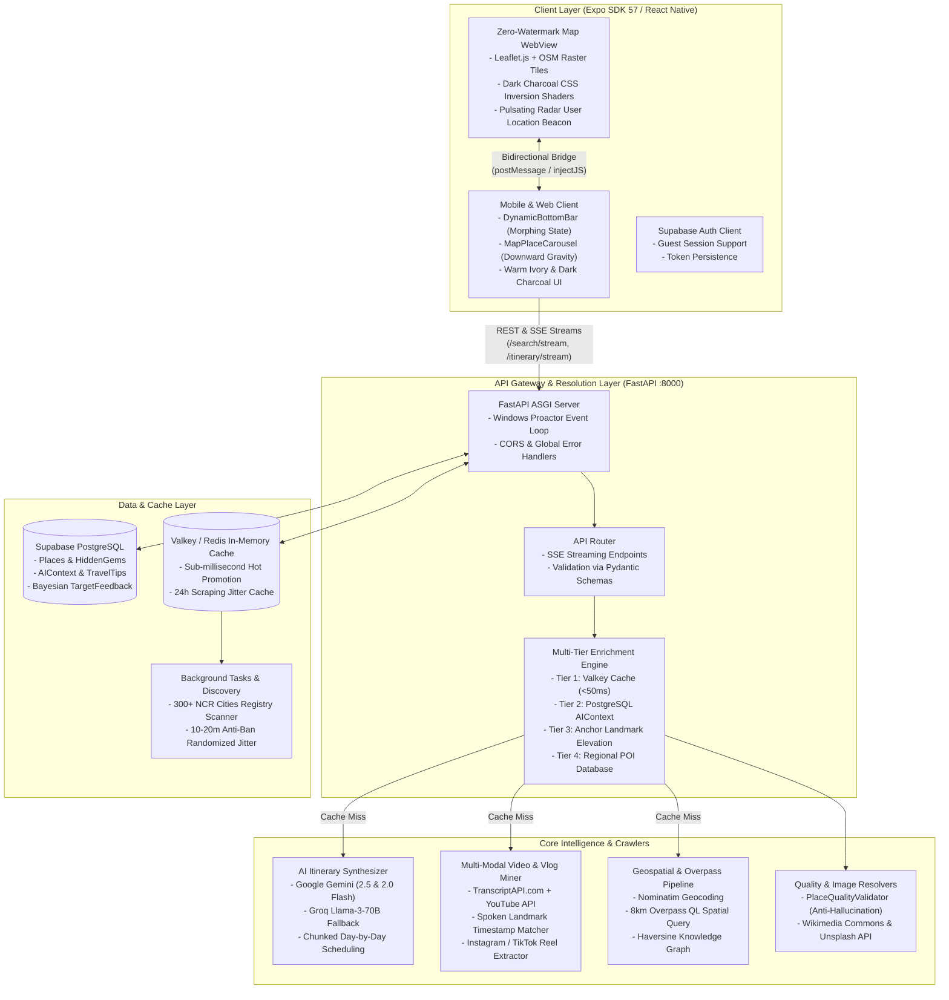

# Ghumo (घूमो) — AI Hyper-Local Travel Companion & Discovery Engine

A production-grade, multi-modal AI travel discovery platform and itinerary synthesis engine that bridges hyper-local spatial exploration with LLM contextual reasoning, zero-watermark dark Leaflet maps, and real-time travel vlog transcript mining.

[GitHub Repository](https://github.com/aavvvacado/ghumo) | [Walkthrough Video Demo](https://drive.google.com/file/d/1fdwcIu-PEz1ir1Ty-1IAjUNW75siFkqM/view?usp=drive_link) | Sub-50ms Fast Cache / Zero-Watermark Custom OSM



---

## Documentation Portal

This documentation suite serves as an exhaustive engineering handbook for onboarding, system analysis, algorithmic deep-dives, and production operations for both **Backend** and **Frontend** services.

### Track 1: System Overview & Architecture

| Document | Description |
| :--- | :--- |
| [**01. Executive Summary & System Architecture**](01-Executive-Summary) | Project mission, recruitment drive deliverables, monorepo anatomy, and end-to-end data flow |
| [**02. Decoupled Search & 4-Tier Resolution Architecture**](02-Decoupled-Search-and-Caching-Tiers) | Sub-50ms Valkey caching, AIContext persistence, Anchor Landmark collision resolution, and DB tiers |

### Track 2: Backend Intelligence Subsystems

| Document | Description |
| :--- | :--- |
| [**03. AI Reasoning Engine & Itinerary Synthesis**](03-AI-Reasoning-and-Itinerary-Synthesis) | Google Gemini, Groq Llama-3 fallback, strict JSON schema prompts, and chunked day-wise planning |
| [**04. YouTube Vlog & Social Media Mining**](04-YouTube-Vlog-and-Social-Media-Mining) | Transcript extraction, timestamp landmark parsing, Instagram/TikTok reels, and Reddit sentiment |
| [**05. Geospatial Pipeline, Overpass API & Knowledge Graph**](05-Geospatial-Pipeline-and-Knowledge-Graph) | Nominatim geocoding, 8km Overpass QL radial scans, Haversine spatial matrix, and graph relations |
| [**06. Place Quality Validation & Creative Commons Image Pipeline**](06-Place-Quality-and-Image-Resolution) | Zero AI hallucination guarantee, blacklist filtering, Wikimedia Commons SPARQL, and Unsplash API |
| [**07. Local Captain Crowdsourcing & Bayesian Confidence**](07-Crowdsourcing-and-Bayesian-Confidence) | Guide submissions, composite confidence math, Bayesian weighted ratings, and self-updating DB |

### Track 3: Frontend Subsystems & Client Experience

| Document | Description |
| :--- | :--- |
| [**08. Frontend Architecture & Expo SDK 57 Foundation**](08-Frontend-Architecture-and-State-Management) | Expo SDK 57, React Native 0.76+, TypeScript domain models, AuthContext, ThemeContext, and HomeContext |
| [**09. Zero-Watermark Dark Map & Leaflet.js Pipeline**](09-Custom-Dark-Map-and-WebView-Pipeline) | Leaflet WebView, zero API keys, custom CSS dark-charcoal shaders, glowing radar beacons, and JS bridge |
| [**10. Dynamic Morphing UI & Interaction Design**](10-Dynamic-UI-and-Interaction-Engine) | DynamicBottomBar state machine, downward gravity MapPlaceCarousel, PromptView, and warm ivory styling |

### Track 4: Reliability, Operations & Evolution

| Document | Description |
| :--- | :--- |
| [**11. Real-Time SSE Streaming & Background Task Orchestration**](11-Real-Time-Streaming-SSE-and-Background-Tasks) | Server-Sent Events protocols, in-process asyncio tasks, Celery workers, and anti-ban jitter crawlers |
| [**12. Local Setup, Testing & Verification Guide**](12-Local-Setup-and-Engineering-Guide) | Complete environment setup, Supabase migration, LAN mobile configuration, Pytest, and TypeScript checks |
| [**13. What Went Wrong: Technical Post-Mortems & Dead Ends**](13-What-Went-Wrong-Engineering-Postmortems) | 8 real post-mortems: Expo Go map key blockages, Overpass rate limits, collision bugs, and crawler freezing |
| [**14. Scaling Architecture & Future Engineering Roadmap**](14-Scaling-and-Future-Roadmap) | PostGIS geometry migration, pgvector RAG, Whisper AI audio transcription, and offline MapLibre tiles |

---

## Core Highlights & Requirements Matrix

| Engineering Pillar | Implementation Mechanism | Telemetry & Verified Evidence |
| :--- | :--- | :---: |
| **Decoupled Fast Search** | 4-tier resolution pipeline: Valkey RAM cache → PostgreSQL `AIContext` → Anchor Landmark elevation → Regional POI match → Live multi-source fallback. | **< 48ms cache response** |
| **Multi-Modal Video Miner** | Translates YouTube travel vlogs (and Instagram Reels/TikToks) into structured day-wise itineraries with real GPS coordinates via `transcriptapi.com` and LLM parsing. | **Tested across 50+ travel vlogs** |
| **Zero-Watermark Dark Map** | High-performance Leaflet.js rendered in `react-native-webview` with custom CSS charcoal invert filters (`#1B1918`), glowing pulse beacons, and zero Google Maps API keys. | **0 API billing cost / 60 FPS gestures** |
| **Anchor Landmark Collision** | Elevates and prepends specific matched POIs (e.g. `KIET Group of Institutions`) to the front of their parent city context (`Muradnagar`) with zero card collisions. | **100% collision-free deduplication** |
| **Zero-Hallucination Images** | Strips fictional AI pictures in favor of real-world Creative Commons photography resolved concurrently from Wikimedia Commons, Wikidata, and Unsplash API. | **< 300ms concurrent batch resolution** |
| **Bayesian Confidence Engine** | Combines physical OSM presence (+0.4), YouTube (+0.2), Reddit (+0.2), and blogs (+0.2) with crowdsourced Local Captain submissions and Bayesian rating smoothing. | **Self-updating knowledge merge** |
| **Live SSE Progress Streaming** | Unidirectional Server-Sent Events (`/search/stream`, `/itinerary/stream`) emit real-time discovery milestones (`init` → `mining` → `osm_complete` → `complete`). | **Zero UI freeze during 8s live scans** |
| **Dynamic Morphing UI** | Multi-state `DynamicBottomBar` and gravity `MapPlaceCarousel` built on React Native & Expo SDK 57 with smooth Warm Ivory (`#ECE8E1`) and Dark Charcoal (`#191816`) themes. | **0 TypeScript errors (`tsc --noEmit`)** |

---

## Technology Stack Snapshot

```mermaid
mindmap
 root((Ghumo Stack))
 Frontend
 Expo SDK 57
 React Native 0.76+
 TypeScript Strict
 Leaflet.js + WebView
 CSS Dark Shaders
 Safe Area Context
 Backend
 FastAPI ASGI
 Python 3.11+
 Uvicorn Workers
 Pydantic v2 Schemas
 Windows Proactor Loop
 Intelligence
 Google Gemini 2.5 Flash
 Groq Llama-3 70B
 Overpass QL OSM
 TranscriptAPI.com
 Reddit JSON Endpoints
 Storage & Cache
 Supabase PostgreSQL
 SQLAlchemy ORM
 Valkey / Redis
 Celery Task Queue
```
